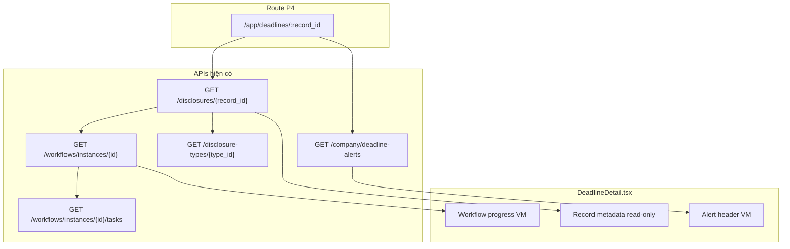

# Implementation Plan — Màn «Chi tiết cảnh báo» (`/app/deadlines/:id`)

**Ngày:** 2026-05-25  
**Phạm vi:** Phase 5 — hoàn thiện `DeadlineDetail.tsx` sau Phase 2–3 (list + load tối thiểu).  
**Bám:** business contract §3.6, P1–P4, template/workflow contract, plan tổng `deadline-alerts-real-data-implementation-plan.md`.

---

## 1. Mục tiêu

| Mục tiêu | Mô tả |
|----------|--------|
| **Đúng identity** | Route `:id` = `record_id` (P4); không dùng `proposal_id` hay `alert_id` giả. |
| **SoT backend** | Header + tiến độ workflow lấy từ API thật; **không** mock milestone/T0 độc lập (H3). |
| **Khớp §3.6** | Hiển thị chi tiết deadline: trạng thái cảnh báo, thời hạn, phòng đang thực hiện; xử lý «đánh dấu hoàn thành» theo quyết định PM (§5). |
| **Khớp template contract** | Workflow steps hiển thị theo snapshot/effective workflow của instance (§6.2 portal-template-va-workflow). |
| **Loại bỏ hành vi giả** | Bỏ toggle bước local, `handleFinish` chỉ đổi state FE, tài liệu mock, CTA không persist. |

---

## 2. Docs consulted

- `cobo_iam_services/docs/ai-cache/deadline-alerts-real-data-implementation-plan.md` (P1–P4, contract list)
- `cobo_iam_services/docs/ai-cache/deadline-alerts-phase2-be-summary.md`
- `cobo_iam_services/docs/ai-cache/deadline-alerts-phase3-fe-summary.md`
- `cobo_iam_services/docs/ai-cache/deadline-alerts-tab-plan-review-summary.md`
- `cobo_web_design/docs/business-contract-summary.md` §3.6, §3.8, §3.9
- `cobo_web_design/docs/business-contracts/portal-template-va-workflow.md` §6.2, §7
- `cobo_web_design/tasks/plan.md` (GAP-5, GAP-6, H3)

---

## 3. Nghiệp vụ đã chốt (chỉ trích — không mở rộng)

| ID | Quyết định | Áp dụng màn detail |
|----|------------|-------------------|
| **P4** | Detail theo `record_id` | `GET /api/v1/disclosures/{record_id}` |
| **P3** | `active_departments` = 1 phòng từ `current_step_code` + snapshot | Sidebar/header «Phòng đang thực hiện» = field từ `GET /company/deadline-alerts` (hoặc navigation state) |
| **H3** | FE không tự tính timeline T0 | Progress bar / ngày bước: dùng `step_timelines` từ workflow instance **nếu BE trả**; không derive từ `T+N` string trên FE |
| **H4** | Không CTA «Tạo cảnh báo mới» trên detail | Xóa mọi CTA tạo mới trên `DeadlineDetail` (`tasks/plan.md`) |
| **§3.6** | Xem chi tiết; đánh dấu hoàn thành | Xem §5 — tách MVP read-only vs hành động thật |
| **§3.8** | Record lifecycle | Trạng thái hồ sơ hiển thị read-only; chuyển `published`/`completed` qua flow hồ sơ, không fake trên alert |
| **§6.2 template** | Bước workflow: tên bước, phòng, `step_deadline` cumulative | Map từ `workflowInstance.workflow[]` (+ department resolve) |

---

## 4. Hiện trạng & gap

### 4.1 Đã có (Phase 3 — `FE-DA-04`)

| Thành phần | Trạng thái |
|------------|------------|
| Route `/app/deadlines/:id` | `id` = `record_id` |
| Load | `disclosureApi.getById` + `deadlineAlertsApi.list` match item |
| Header partial | `title`, `dueDate`, `activeDepartments`, badge status từ alert |
| Deep link | «Xem hồ sơ đầy đủ» → `/app/history/{record_id}` |
| Workflow fetch | `getById(workflowInstanceId)` **gọi nhưng không bind UI** |

### 4.2 Còn mock / sai contract

| Vùng UI | Vấn đề |
|---------|--------|
| `milestones[]` hardcoded | Vi phạm H3; không khớp workflow thật |
| 4× `WorkflowCard` + `toggleStage` | Hành vi giả; không API |
| `handleFinish` / `handleUpdate` | Chỉ `setState` local |
| `DocumentList` fake | Không map `record.attachments` / workflow documents |
| Progress bar 62.5% animation | Trang trí mock |
| Nút Settings / ExternalLink | No-op |
| Footer «Xác nhận kết thúc» | Không map `disclosure_records.status` / workflow terminal |

### 4.3 Gap kỹ thuật

| Gap | Mức | Xử lý trong Phase 5 |
|-----|-----|-------------------|
| Detail load qua `list?pageSize=200` | Perf | Ưu tiên `location.state` từ list; optional `GET ...?record_id=` |
| `WorkflowInstanceDto` thiếu `current_step_code` | Map bước active | FE-DA-D02: mở rộng type + normalizer từ BE JSON |
| Department label trên steps | UX | Resolve `department_id` → tên (reuse API phòng ban nếu đã có ở portal) |
| `step_timelines` có thể rỗng | H3 fallback | Hiển thị `processing_days` / label bước; không tính T0 |

---

## 5. Quyết định PO đã chốt (2026-05-25)

**Nguồn:** `deadline-alert-detail-ba-decision-questionnaire.md` §G · **Tóm tắt:** `deadline-alert-detail-po-decisions-summary.md`

### 5.1 Hành vi màn detail (HC-1 — persist, không mock local)

| Thành phần UI | Quyết định PO | Engineering |
|---------------|---------------|-------------|
| Toggle «Hoàn thành» từng card | HC-1 | Map workflow task/step; **không** `toggleStage` local |
| Sidebar «Đã Công bố/Báo cáo đúng hạn» | HC-1 | API → `published`/`completed`, alert `DONE` |
| Footer: Hủy / Cập nhật / Xác nhận kết thúc | HC-1 | Wire API; **xóa** `handleFinish` / `handleUpdate` giả |
| Layout cockpit | HC (timeline + 4 card + sidebar + footer) | Giữ shell mock; bind API |
| Bước 4 email + InfoBox | **A — ẩn** | Không implement checklist/InfoBox bước 4 |
| Sidebar dịch thuật | **A — bỏ** | Xóa widget |
| Done trên list/detail | HC | `published` hoặc `completed` → `DONE` |

### 5.2 List header (OQ-DA-06)

- Đổi nhãn: **«Tạo cảnh báo bất thường»**
- Route: **`/app/ad-hoc-proposals/new`** (flow ad-hoc hiện có), không `/app/disclosures/new` trên tab Cảnh báo thời hạn.

### 5.3 API blockers (trước FE wire mutations)

Xem bảng §3 trong `deadline-alert-detail-po-decisions-summary.md` — tối thiểu: confirm completion, step/toggle sync, record notes, `step_timelines` / `remaining_days`.

**Cấm:** `setStatus('Done')`, `completedStages` local sau khi HC-1 wire xong.

---

## 6. Kiến trúc dữ liệu

**Nguyên tắc:**

- Không bắt buộc endpoint aggregated detail mới cho MVP.
- `active_departments`, `due_date`, `status` alert: ưu tiên item từ list hoặc `location.state`; fallback list query `record_id` khi deep-link trực tiếp.

---

## 7. UI contract (màn «Chi tiết cảnh báo»)

Màn này là **lens cảnh báo thời hạn**, không clone full `DisclosureDetail` (nội dung dài, edit draft).

| Section | Giữ / thêm | Bỏ / thay |
|---------|------------|-----------|
| Breadcrumb | Dashboard → Cảnh báo → `record_id` | — |
| Banner | Link «Xem hồ sơ đầy đủ» | — |
| Header | Title, badge alert status, due date, phòng active, `record_id` | Settings/ExternalLink no-op |
| Workflow overview | Steps từ instance (read-only); highlight current step | Mock milestones + arrow % giả |
| Sidebar metadata | Loại CBTT, planned date, record status, template category (từ type) | — |
| Task panel (5B) | Optional condensed tasks | Full duplicate DisclosureDetail |
| Footer sticky | «Quay lại» + CTA sang hồ sơ | «Xác nhận kết thúc» giả, «Tạo cảnh báo mới» |

---

## 8. Field mapping

### 8.1 Header (alert lens)

| UI label | Nguồn | Ghi chú |
|----------|--------|---------|
| Tiêu đề | `disclosure.title` hoặc `alert.title` | Alert list đã có |
| Trạng thái cảnh báo | `alert.status` → `Upcoming`…`Done` | Normalizer `deadlineAlertsApi` |
| Thời hạn cảnh báo | `alert.dueDate` | Không `record.plannedDate` nếu alert có due |
| Phòng đang thực hiện | `alert.activeDepartments[]` | P3; không `owner` |
| Mã hồ sơ | `record.id` | P4 |

### 8.2 Workflow steps (read-only)

| UI | Nguồn |
|----|--------|
| Tên bước | `workflow[].stage` hoặc label từ snapshot step |
| Phòng bước | `department_id` → resolve name; bước current = khớp `active_departments` |
| Trạng thái bước | So sánh index/`step_id` với `current_step_code` + `instance.status` |
| Khoảng thời gian | `step_timelines[].start_at/end_at` nếu có; else ẩn hoặc hiện `processing_days` |

### 8.3 Type / template (sidebar)

| UI | Nguồn |
|----|--------|
| Loại công bố | `GET /disclosure-types/{type_id}` |
| Nature / category | `template_category` từ alert hoặc type config |
| Ẩn tần suất | `irregular` → không render periodicity (`portal-template` §7.3) |

---

## 9. Lộ trình & tickets

### Phase 5.0 — Chốt câu hỏi BA

- [x] PO đã chốt questionnaire (§G) — **HC-1 persist** + cắt scope 10/11 = A
- [x] Canonical summary: `deadline-alert-detail-po-decisions-summary.md`
- [ ] Approve **API contract** §5.3 / po-decisions-summary §3

### Phase 5.1 — Foundation (FE)

| Ticket | Việc | AC |
|--------|------|-----|
| **FE-DA-D01** | `deadlineAlertDetailViewModels.ts`: `toDeadlineAlertDetailVM(alert, record, workflow?, type?)` | Unit test: header fields, empty workflow fallback |
| **FE-DA-D02** | Mở rộng `WorkflowInstanceDto` + normalizer: `current_step_code` | Không break `DisclosureDetail` |
| **FE-DA-D03** | Refactor `loadDetail`: lưu `workflowInstance`, `workflowTasks`; bỏ `completedStages` local | Loading/error states tách workflow vs record |
| **FE-DA-D04** | List navigation: `navigate(..., { state: { alert } })` từ `DeadlineList` | Deep link vẫn fallback list/filter |

### Phase 5.2 — UI thật (FE)

| Ticket | Việc | AC |
|--------|------|-----|
| **FE-DA-D05** | Thay mock timeline bằng `WorkflowStepsOverview` (component mới hoặc extract từ pattern disclosure) | Manual: ad-hoc approved record có đúng số bước |
| **FE-DA-D06** | Department label resolver (cache list departments) | Bước current hiển thị đúng tên phòng |
| **FE-DA-D07** | Sidebar: type name, record status, template category | Không mock `FormField` dates |
| **FE-DA-D08** | Cleanup: xóa `WorkflowCard` toggle, fake docs, `handleFinish`, no-op icons, «Tạo cảnh báo mới» | ESLint/build pass |

### Phase 5.3 — Mutations (PO HC-1)

| Ticket | Việc | AC |
|--------|------|-----|
| **BE-DA-D10** | API xác nhận hoàn tất / publish → alert DONE | Integration test; permission |
| **BE-DA-D11** | Step completion / task action contract (toggle card) | Map `current_step_code` |
| **BE-DA-D12** | Record notes API (sidebar ghi chú) | GET/PUT theo `record_id` |
| **BE-DA-D13** | `remaining_days` hoặc field aggregated cho form card | Optional on deadline-alerts hoặc workflow |
| **FE-DA-D15** | Wire footer + sidebar + toggle (HC-1) | Không local state; E2E publish |
| **FE-DA-D16** | Notes sidebar persist | BE-DA-D12 |
| **FE-DA-D18** | Bỏ dịch thuật; bước 4 không email/InfoBox | PO 10/11 = A |
| **FE-DA-D19** | List: «Tạo cảnh báo bất thường» → ad-hoc new | OQ-DA-06 |

### Phase 5.4 — BE tùy chọn (perf deep-link)

| Ticket | Việc | AC |
|--------|------|-----|
| **BE-DA-D01** | `GET /company/deadline-alerts?record_id={uuid}` **hoặc** `GET .../deadline-alerts/{record_id}` | 1 item hoặc 404; auth `deadline.view` |
| **BE-DA-D02** | Đảm bảo `GET /workflows/instances/{id}` JSON có `current_step_code` + `workflow[]` | Contract doc 1 dòng trong plan BE |

**Không làm:** endpoint `POST /deadline-alerts/.../complete` trừ khi BA định nghĩa contract mới.

---

## 10. Thứ tự triển khai đề xuất

1. **FE-DA-D01 → D04** (data + navigation)  
2. **FE-DA-D02** (align workflow DTO)  
3. **FE-DA-D05 → D08** (UI thật + cleanup)  
4. **FE-DA-D09** (5A hoàn thành)  
5. Chốt **OQ-DETAIL-01** → **FE-DA-D10** nếu cần  
6. **BE-DA-D01** khi deep-link / perf trở thành vấn đề  

Song song: cập nhật `deadline-alerts-real-data-implementation-plan.md` §7 thêm Phase 5 link.

---

## 11. Kiểm thử

### Unit

- `toDeadlineAlertDetailVM`: alert Done, missing workflow, single active department
- Workflow step status mapper: current / completed / upcoming

### Manual E2E

1. Ad-hoc approved → card → «Chi tiết cảnh báo»  
2. Header: title, due, phòng = `active_departments[0]`  
3. Workflow steps khớp instance (số bước, tên stage)  
4. «Xem hồ sơ đầy đủ» mở history; task action **không** bắt buộc trên alert (5A)  
5. Record `published` → alert `Done`, không toggle giả  
6. Deep-link `/app/deadlines/{record_id}` không qua list → vẫn load (list fallback hoặc BE-DA-D01)  
7. Permission `deadline.view` thiếu → 403 rõ ràng  

### Regression

- `DeadlineList` tab History không đổi  
- `DisclosureDetail` workflow không regression sau D02  

---

## 12. Out of scope

- Endpoint aggregated «alert detail» gộp disclosure+workflow (có thể phase sau)
- Tính T0 / `T+N` trên FE từ template config
- Multi-active departments (H2 Option A/B)
- CRUD ad-hoc proposal trên màn detail
- Periodic worker bật workflow (P1 note — ticket BE-DA-07 riêng)
- Redesign visual toàn màn (chỉ thay data binding + bỏ mock)

---

## 13. Tham chiếu file

| Vai trò | Path |
|---------|------|
| FE detail (WIP) | `cobo_web_design/src/pages/portal/DeadlineDetail.tsx` |
| FE list navigate | `cobo_web_design/src/pages/portal/DeadlineList.tsx` |
| FE pattern workflow | `cobo_web_design/src/pages/portal/DisclosureDetail.tsx` |
| FE alert API | `cobo_web_design/src/services/deadlineAlertsApi.ts` |
| FE card VM | `cobo_web_design/src/services/deadlineAlertViewModels.ts` |
| BE alerts | `cobo_iam_services/internal/deadlinealerts/` |
| Plan tổng | `cobo_iam_services/docs/ai-cache/deadline-alerts-real-data-implementation-plan.md` |

---

## 14. Liên kết plan tổng

Phase 2–4 (list, BE aggregated, worker verify) — **done / in progress** theo summary cache.  
**Phase 5 (tài liệu này)** = hoàn thiện «Chi tiết cảnh báo» đúng contract, sau `FE-DA-04` tối thiểu.
