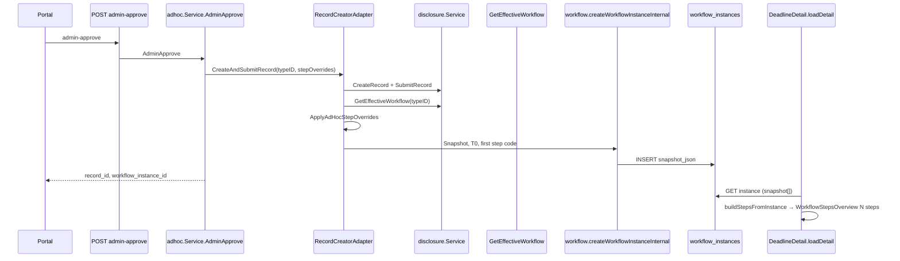
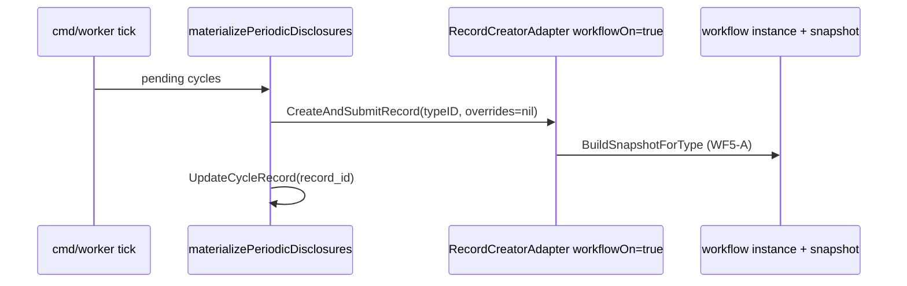

# Implementation Plan — Workflow overview đủ bước (Chi tiết cảnh báo)

**Ngày:** 2026-05-26  
**Repos:** `cobo_iam_services` (BE), `cobo_web_design` (FE)  
**PO decisions (canonical):**

| ID | Chốt |
|----|------|
| OQ-WF-01 | **WF-A** — Materialize periodic/custom luôn tạo `workflow_instance` + snapshot |
| OQ-WF-02 | **WF2-A** — Có `workflow_instance_id` mà snapshot rỗng → lỗi tích hợp (retry), không UX degraded chuẩn |
| OQ-WF-03 | **WF3-A + WF3-C** — `current_step_index=0`, code = bước đầu snapshot, `in_progress`; UI không `completed` giả khi chưa xử lý |
| OQ-WF-04 | **WF4-A** — `WORKFLOW_SNAPSHOT_ENABLED=true` mọi môi trường nghiệm thu |
| OQ-WF-05 | **WF5-B** irregular = effective workflow + `step_overrides`; **WF5-A** periodic/custom = effective workflow |
| OQ-DA-01 | **DC-B** — `PENDING_CONFIRM` khi record terminal chưa confirm; `DONE` sau `POST .../confirm` |
| OQ-DA-03 | **HC chỉ edge case** — materialize lỗi / record cũ không instance |
| AL-8 | **AL-B** — List record chưa workflow nếu vẫn có thời hạn theo dõi (§3.6) |

**Tài liệu contract tham chiếu:** `deadline-alert-detail-phase5-execution-plan.md`, `deadline-alerts-real-data-implementation-plan.md`, `adhoc-approved-not-in-deadlines-tab-summary.md`, `business-contract-periodic-auto-creation.md`, `business-contract-adhoc-alert-create.md` §2, `deadline-alert-detail-ba-decision-questionnaire.md` (OQ-DA-03 HC).

**Ưu tiên nguồn sự thật:** Quyết định PO **2026-05-26** (bảng trên) **thay thế** các mục xung đột trong `deadline-alert-detail-po-decisions-summary.md` (2025-05-25) — xem §0.

---

## 0. Supersedes / amends tài liệu PO cũ

Khi triển khai plan này, dùng bảng PO 2026-05-26 làm canonical. Cập nhật doc cũ qua ticket **DOC-WF-02** (không block dev BE/FE).

| Chủ đề | Doc 2025-05-25 | PO / plan 2026-05-26 | Hành động DOC-WF-02 |
|--------|----------------|----------------------|---------------------|
| **OQ-DA-01 / Done** | OQ-DA-01 **HC**: `published` \| `completed` → **DONE**; §0 bước 3: publish → derive DONE | **DC-B**: terminal → **PENDING_CONFIRM**; **DONE** chỉ sau `POST /api/v1/company/deadline-alerts/{id}/confirm` + `deadline.manage` | Sửa `po-decisions-summary` §0 bước 3 và OQ-DA-01; tham chiếu `adhoc-approved-not-in-deadlines-tab-summary.md` |
| **OQ-DA-03 / degraded** | HC: detail degraded khi **thiếu workflow instance** (định kỳ thường chưa có instance) | **WF-A** + OQ-DA-03 thu hẹp: degraded **chỉ** materialize lỗi / record cũ không instance | Sửa alignment assessment dòng periodic «degraded nếu chưa workflow» |
| **Publish vs confirm** | §0 vẫn đúng: workflow xong + publish + evidence | DC-B **bổ sung** bước confirm cảnh báo sau publish; không thay publish | Ghi chú trong `po-decisions-summary` §0 |

**Không mâu thuẫn nghiệp vụ:** §0 PO (publish + evidence) vẫn áp dụng; DC-B chỉ thêm lớp **xác nhận cảnh báo** trước badge Done trên tab (code: `resolveDueDateAndStatus` trong `deadlinealerts/app/service.go`).

**WF-A supersedes periodic contract:** [business-contract-periodic-auto-creation.md](cobo_web_design/docs/ai-cache/skill-outputs/business-contract-periodic-auto-creation.md) §Architecture ghi worker **workflow DISABLED** — sau WF-A phải cập nhật doc mô tả `RecordCreatorAdapter` + `workflowOn: true` trong worker.

---

## 1. Mục tiêu kỹ thuật

1. `GET /api/v1/workflows/instances/{id}` trả `snapshot[]` đầy đủ (đọc từ `workflow_instances.snapshot_json`).
2. Tạo instance (ad-hoc approve + periodic materialize) ghi `snapshot_json` từ effective workflow (và merge override ad-hoc).
3. FE `WorkflowStepsOverview` hiển thị **N** thẻ bước + trạng thái; `workflowDegraded` chỉ khi **không** có `workflow_instance_id`.
4. Có instance nhưng `steps.length===0` → banner lỗi + retry (`WF2-A`).

---

## 2. Database

### 2.1 Bảng đã có (không migration bắt buộc cho snapshot read)

| Bảng | Cột liên quan | Ghi chú |
|------|----------------|---------|
| `workflow_instances` | `workflow_instance_id`, `company_id`, `record_id`, `status`, `current_step_code`, `snapshot_json`, `t0_date`, `t0_policy`, `workflow_source` | Migration `0032_customize_workflow_extension.up.sql` |
| `workflow_tasks` | `task_id`, `workflow_instance_id`, `step_code`, `status` | Task đầu vẫn tạo tại `createWorkflowInstance` |
| `disclosure_records` | `record_id`, `type_id`, `planned_date`, `status` | `workflow_instance_id` lấy qua JOIN (subquery), không cột trên `disclosure_records` |
| `ad_hoc_proposals` | `proposed_workflow_json` (JSON: `step_overrides`, `proposed_deadline_days`) | WF5-B nguồn override |
| `periodic_cycles` | `record_id`, `type_id`, `company_id`, `due_date` | Sau WF-A: `record_id` + workflow qua materialize |
| `deadline_alert_confirmations` | `company_id`, `record_id`, `confirmed_by`, `confirmed_at` | DC-B — migration `0076` |

**Gap hiện tại:** `FindInstance` không SELECT `snapshot_json` → response rỗng dù DB có dữ liệu.

### 2.2 Migration tùy chọn (Phase 1b — chỉ nếu muốn persist index trên BE)

| Migration | Nội dung |
|-----------|----------|
| `00XX_workflow_instances_current_step_index.up.sql` | `ALTER TABLE workflow_instances ADD COLUMN current_step_index INT NOT NULL DEFAULT 0 AFTER current_step_code;` |

**Khuyến nghị:** Phase 1 có thể **không** thêm cột; FE derive `current_step_index` từ `current_step_code` + `snapshot` (đã có trong `normalizeWorkflowInstanceDto`). PO WF3-A chỉ yêu cầu index logic = 0 lúc tạo.

### 2.3 Dữ liệu snapshot (JSON trong `snapshot_json`)

Mảng phần tử theo `workflowapp.StepSnapshot` (`internal/workflow/app/contracts.go`):

```json
{
  "step_id": "string",
  "step_code": "string (optional)",
  "stage": "string",
  "department": "string",
  "assignee_role": "string (optional)",
  "due_rule": "T+N",
  "display_order": 1,
  "processing_days": 3
}
```

---

## 3. API endpoints (runtime contract)

### 3.1 FE load Chi tiết cảnh báo (không đổi thứ tự)

| # | Method | Path | Permission | Handler / Service |
|---|--------|------|------------|-------------------|
| 1 | GET | `/api/v1/disclosures/{record_id}` | `disclosure.view` | `disclosure/transport/http/handler.go` → `disclosureapp.Service.GetRecord` |
| 2 | GET | `/api/v1/company/deadline-alerts?page&page_size&status&q` | `deadline.view` | `deadlinealerts/transport/http/handler.go` → `listDeadlineAlerts` → `deadlinealertsapp.Service.ListDeadlineAlerts` |
| 3 | GET | `/api/v1/workflows/instances/{instance_id}` | `workflow.read` | `workflow/transport/http/handler.go` → `getInstance` → `workflowapp.Service.GetWorkflowInstance` |
| 4 | GET | `/api/v1/workflows/instances/{instance_id}/tasks` | `workflow.read` | `listInstanceTasks` |
| 5 | GET | `/api/v1/disclosure-types/{type_id}` | type read | Sidebar metadata |
| 6 | POST | `/api/v1/company/deadline-alerts/{record_id}/confirm` | `deadline.manage` (`deadline.confirm`) | DC-B — đã có |

**FE client paths:** `disclosureApi.getById`, `deadlineAlertsApi.list`, `workflowInstancesApi.getById` / `listTasks` (`workflowApiContract.workflowInstancePath`).

### 3.2 BE nội bộ (không expose portal, dùng khi seed snapshot)

| Method | Path | Gọi từ |
|--------|------|--------|
| GET | `/api/v1/disclosure-types/{type_id}/effective-workflow` | `disclosureapp.Service.GetEffectiveWorkflow` — WF5-A / merge WF5-B |

### 3.3 Ad-hoc approve (trigger tạo record + workflow)

| Method | Path | Handler | Service |
|--------|------|---------|---------|
| POST | `/api/v1/company/ad-hoc-proposals/{proposal_id}/admin-approve` | `adhoc/transport/http/handler.go` → `adminApprove` | `adhocapp.Service.AdminApprove` |

### 3.4 Không thêm endpoint mới cho overview

Snapshot đọc qua **GET instance** hiện có (sau fix `FindInstance`).

---

## 4. Backend — thay đổi theo function

### 4.1 Module `workflow` (`cobo_iam_services`)

#### 4.1.1 `internal/workflow/infra/mysql/repository.go`

| Function | Thay đổi |
|----------|----------|
| `FindInstance(ctx, companyID, workflowInstanceID)` | SELECT thêm `snapshot_json`, `workflow_source`; `json.Unmarshal` → `in.Snapshot []StepSnapshot`; trả DTO đầy đủ |
| `CreateInstance` | (giữ) đã INSERT `snapshot_json` khi `len(in.Snapshot)>0` |

**SQL mẫu `FindInstance`:**

```sql
SELECT workflow_instance_id, company_id, record_id, status, current_step_code, created_by,
       t0_date, t0_policy, workflow_source, snapshot_json
FROM workflow_instances
WHERE company_id = ? AND workflow_instance_id = ?
```

#### 4.1.2 `internal/workflow/app/service.go`

| Function | Thay đổi |
|----------|----------|
| `createWorkflowInstance(ctx, req)` | **WF3-A:** `CurrentStepCode` = `firstStepCode(req.Snapshot)` (theo `display_order`), không hardcode `"review"`; `Status` = `in_progress`; tạo task đầu với `StepCode` = cùng `firstStepCode` |
| `CreateWorkflowInstanceInternal` | Không đổi signature; caller truyền `Snapshot`, `WorkflowSource` |

**Helper mới (đề xuất file `internal/workflow/app/snapshot.go`):**

| Function | Mô tả |
|----------|--------|
| `FirstStepCode(snapshot []StepSnapshot) string` | Bước `display_order` nhỏ nhất; fallback `step_id` |
| `ValidateSnapshot(snapshot []StepSnapshot) error` | Ít nhất 1 bước khi snapshot enabled |

#### 4.1.3 `internal/workflow/transport/http/handler.go`

| Function | Thay đổi |
|----------|----------|
| `getInstance` | Không đổi; response tự đầy đủ sau `FindInstance` fix |

#### 4.1.4 Tests

| File | Case |
|------|------|
| `internal/workflow/infra/mysql/repository_test.go` (mới hoặc mở rộng) | CreateInstance với snapshot → FindInstance round-trip |
| `internal/workflow/app/service_test.go` | `createWorkflowInstance` set `current_step_code` = bước 1 |

---

### 4.2 Module snapshot builder (mới — `internal/workflow/app` hoặc `internal/disclosure/app`)

| Function | Input | Output | PO |
|----------|-------|--------|-----|
| `MapEffectiveWorkflowToSnapshot(steps []disclosureapp.WorkflowStepDTO, source string) []workflowapp.StepSnapshot` | Effective workflow steps | `[]StepSnapshot` + `workflow_source` | WF5-A |
| `ApplyAdHocStepOverrides(snapshot []StepSnapshot, overrides []adhocapp.WorkflowStepOverride) []StepSnapshot` | Snapshot + `step_overrides` | Copy snapshot, patch `processing_days` theo `step_id` | WF5-B |
| `BuildSnapshotForType(ctx, disclosureSvc disclosureapp.Service, subject disclosureapp.Subject, typeID string) ([]StepSnapshot, string, error)` | Gọi `disclosureSvc.GetEffectiveWorkflow(ctx, GetEffectiveWorkflowRequest{Subject: subject, TypeID: typeID})` — **không** gọi `Repository` trực tiếp từ adapter | Snapshot + `workflow_source` (`global_template` / `company_override` từ `EffectiveWorkflowDTO.Source`) | WF5-A |

**Lưu ý WF5-B:** Contract ad-hoc (`adhoc/app/contracts.go`) chỉ lưu `WorkflowStepOverride{step_id, processing_days}` — **không** lưu full proposed steps. Snapshot **đầy đủ** = effective workflow + apply overrides (đúng PO, không suy đoán thêm field DB).

---

### 4.3 Module `adhoc` — irregular (WF5-B)

#### 4.3.1 `internal/adhoc/infra/disclosure/record_creator.go`

| Function | Thay đổi |
|----------|----------|
| `CreateAndSubmitRecord(...)` | **Đổi signature** (breaking nội bộ) hoặc thêm struct `CreateRecordParams` gồm: `CompanyID`, `TypeID`, `MembershipID`, `Title`, `T0Date`, `StepOverrides []WorkflowStepOverride` |
| | Sau `SubmitRecord`: `subject` = `disclosureapp.Subject` từ company/membership; snapshot = `BuildSnapshotForType(ctx, a.svc, subject, typeID)` + `ApplyAdHocStepOverrides(..., stepOverrides)` |
| | `CreateWorkflowInstanceInternal` với `Snapshot`, `T0Date`, `T0Policy`; bắt buộc `workflowOn && flags.SnapshotEnabled` (WF4-A) |
| | Lỗi workflow sau khi record đã tạo: trả `recordID, ""` (edge OQ-DA-03 — có record, không instance); không coi là happy path |

#### 4.3.2 `internal/adhoc/app/service.go`

| Function | Thay đổi |
|----------|----------|
| `AdminApprove` | Khi gọi `recordCreator.CreateAndSubmitRecord`, truyền `cur.StepOverrides` từ `ProposalDTO` (đã load từ `proposed_workflow_json`) |

#### 4.3.3 `internal/adhoc/app/contracts.go`

| Type | Thay đổi |
|------|----------|
| `RecordCreator` interface | `CreateAndSubmitRecord(..., stepOverrides []WorkflowStepOverride)` hoặc `CreateRecordParams` |

---

### 4.4 Module `disclosure` — periodic (WF-A)

#### 4.4.1 `cmd/worker/main.go`

| Vị trí | Thay đổi |
|--------|----------|
| `tick()` setup | `periodicCreator = adhocrecord.NewRecordCreatorAdapter(disclosureSvc, workflowSvc, true)` — **bật workflow** (hiện: `nil`, `false`) |
| | Cần `workflowSvc` khởi tạo trong worker (mirror `httpserver/server.go`: `workflowapp.NewService` + `WithFlags(SnapshotEnabled: cfg.WorkflowSnapshotEnabled)`) |

#### 4.4.2 `internal/disclosure/app/periodic.go`

| Function | Thay đổi |
|----------|----------|
| `materializePeriodicDisclosures` | Nhận `workflowInstanceID` từ `creator.CreateAndSubmitRecord`; optional: log metric nếu `workflowInstanceID==""` (materialize lỗi một phần — edge OQ-DA-03) |
| | Hiện bỏ qua return thứ 2: `recordID, _, err :=` → `recordID, wfID, err :=` |

#### 4.4.3 `RecordCreatorAdapter` (shared)

Periodic gọi cùng adapter với `StepOverrides = nil` → chỉ WF5-A (effective workflow).

---

### 4.5 Module `deadlinealerts` (AL-B, DC-B — xác nhận, ít đổi)

#### 4.5.1 `internal/deadlinealerts/infra/mysql/repository.go`

| Function | Trạng thái |
|----------|------------|
| `ListRows` | **AL-B (PO 2026-05-26):** Giữ `LEFT JOIN workflow_instances`; **không** thêm `WHERE wi.workflow_instance_id IS NOT NULL`. Record không có instance vẫn có thể xuất hiện trên tab nếu có ngày hạn. |
| `ConfirmDeadlineAlert` | DC-B — giữ |

**Định nghĩa AL-B (không đổi rule SQL trừ khi BA bổ sung sau):**

- List vẫn qua `deadlinealertsapp.Service.ListDeadlineAlerts` → `ListRows` (P2: `status <> draft`).
- **Không** yêu cầu `workflow_instance_id` để vào list.
- Row vẫn bị loại nếu `resolveDueDateAndStatus` trả `dueDate == ""` (giữ logic hiện tại trong `service.go`) — AL-B **không** có nghĩa «list mọi record không workflow», mà «không filter bắt buộc phải có workflow».
- `active_departments` trên card vẫn derive từ `current_step_code` + `snapshot_json` khi có instance; `—` khi không có (P3).

#### 4.5.2 `internal/deadlinealerts/app/service.go`

| Function | Trạng thái |
|----------|------------|
| `resolveDueDateAndStatus` | DC-B — terminal → `PENDING_CONFIRM`; có confirmation → `DONE` |
| `ListDeadlineAlerts` | Map `WorkflowInstanceID` → FE |

#### 4.5.3 `internal/deadlinealerts/app/status.go` (hoặc tương đương)

| Function | Trạng thái |
|----------|------------|
| `normalizeStatusFilter` | Hỗ trợ `PENDING_CONFIRM` — đã có theo `adhoc-approved-not-in-deadlines-tab-summary.md` |

---

### 4.6 Config / wire (`internal/httpserver/server.go`, `internal/platform/config/config.go`)

| Config | WF4-A |
|--------|-------|
| `WORKFLOW_SNAPSHOT_ENABLED` | `true` trên dev/staging/prod |
| `PERIODIC_SEEDING_ENABLED` | Giữ; worker cần workflow svc |
| `WORKFLOW_ADHOC_ENABLED` | Giữ `true` cho approve path |

| File | Function / block |
|------|------------------|
| `server.go` | Đã: `recordCreator := adhocrecord.NewRecordCreatorAdapter(disclosureSvc, workflowSvc, true)` |
| `cmd/worker/main.go` | **Sửa:** inject `workflowSvc` + `workflowOn: true` |

---

## 5. Frontend — thay đổi theo function

### 5.1 Services (`cobo_web_design/src/services`)

| File | Function | Thay đổi |
|------|----------|----------|
| `deadlineAlertDetailViewModels.ts` | `toDeadlineAlertDetailVM` | `workflowDegraded = !hasWorkflow` (**OQ-DA-03 edge only**); bỏ `hasWorkflow && steps.length===0` |
| | `buildStepsFromInstance` | Giữ; phụ thuộc `instance.workflow` sau BE fix |
| | **Mới** `buildPendingWorkflowInitStep(): DeadlineAlertWorkflowStepVM` | Bước ảo OQ-DA-03 HC: `stepId: 'pending_init'`, `label: 'Chờ khởi tạo quy trình'`, `uiStatus: 'current'`, `stage`/`department` placeholder hoặc `—` |
| | `toDeadlineAlertDetailVM` (tiếp) | Khi `!hasWorkflow`: `steps = [buildPendingWorkflowInitStep()]`; `workflowDegraded = true`; **không** gọi `buildStepsFromInstance` |
| | `resolveStepUiStatus` | **WF3-C:** tại `currentStepIndex===0` và `status!=='completed'`, không bước nào `completed` (đã đúng với `stepIndex < 0`); thêm test |
| | **Mới** `hasWorkflowSnapshotError(instanceId, steps)` | `Boolean(instanceId) && steps.length===0` → WF2-A (không inject bước ảo) |
| `workflowOverrideMappers.ts` | `normalizeWorkflowInstanceDto` | Giữ map `snapshot` → `workflow`; verify sau BE trả JSON |
| `snapshotToWorkflowSteps.ts` | `mapSnapshotToWorkflowSteps` | Giữ |
| `deadlineAlertsApi.ts` | `normalizeDeadlineAlert`, `confirm` | DC-B — đã có |
| `deadlinePublishReadiness.ts` | `assessPublishReadiness` | Chặn publish khi `Pending Confirm` — giữ |

### 5.2 Pages / components

| File | Function / vùng | Thay đổi |
|------|-----------------|----------|
| `pages/portal/DeadlineDetail.tsx` | `loadDetail` | Sau load: nếu `hasWorkflowSnapshotError` → `setWorkflowLoadError(message)` + nút retry gọi `reloadWorkflow` |
| | render overview | Edge `!hasWorkflow`: `degraded={true}`, `showProgressOnly={false}` (VM đã có 1 step ảo → overview render card); **Bỏ** progress-only trống |
| | | Có `workflow_instance_id` mà `steps.length===0` → error block WF2-A + retry; không `degraded` / không bước ảo |
| | banner | Giữ banner vàng **chỉ** `!hasWorkflow` (OQ-DA-03); message edge: «Chờ khởi tạo quy trình» |
| `pages/portal/deadlines/WorkflowStepsOverview.tsx` | `WorkflowStepsOverview` | Parent truyền `steps` từ VM: edge `!hasWorkflow` → **1 card** bước ảo (VM đã inject); `showProgressOnly={false}` khi `steps.length >= 1` |
| | | Banner vàng (parent `DeadlineDetail`) + 1 card «Chờ khởi tạo quy trình» — **không** chỉ progress bar trống (questionnaire OQ-DA-03 HC) |
| | | Xóa/ không dùng nhánh message «Đang xử lý workflow — chi tiết từng bước chưa tải được» khi có `workflow_instance_id` (WF2-A → error block ở parent) |
| `pages/portal/deadlines/DeadlineWorkflowCard.tsx` | map steps | Giữ khi `detailVm.steps.length > 0` |
| `pages/portal/DeadlineList.tsx` | badge `Pending Confirm` | DC-B — giữ |
| `pages/portal/deadlines/DeadlineAlertDetailSidebar.tsx` | confirm vs publish | DC-B — giữ |

### 5.3 Tests FE

| File | Case |
|------|------|
| `deadlineAlertDetailViewModels.test.ts` | `workflowDegraded` false khi có instance + steps; true khi không instance |
| | | `!hasWorkflow` → `steps.length === 1`, `steps[0].stepId === 'pending_init'`, `uiStatus === 'current'` |
| `WorkflowStepsOverview.test.tsx` | Render 1 card «Chờ khởi tạo quy trình» khi parent truyền synthetic step |
| | | Empty steps + có instance → parent error wrapper (WF2-A), không degraded overview |
| `deadlinePublishReadiness.test.ts` | `Pending Confirm` |

---

## 6. Luồng dữ liệu (sequence)

### 6.1 Ad-hoc approve → Chi tiết cảnh báo



### 6.2 Periodic materialize (WF-A)



---

## 7. Tickets triển khai (thứ tự)

| ID | Repo | Phụ thuộc | Mô tả ngắn |
|----|------|-----------|------------|
| OPS-01 | ops | — | `WORKFLOW_SNAPSHOT_ENABLED=true`; migration `0076` |
| BE-WF-01 | BE | OPS-01 | `FindInstance` đọc `snapshot_json` — **≡ BE-DA-D02** (`deadline-alert-detail-phase5-execution-plan.md`) |
| BE-WF-02 | BE | BE-WF-01 | `snapshot.go` + `firstStepCode`; sửa `createWorkflowInstance` |
| BE-WF-03 | BE | BE-WF-02 | `MapEffectiveWorkflowToSnapshot`, `ApplyAdHocStepOverrides`, `BuildSnapshotForType` |
| BE-WF-04 | BE | BE-WF-03 | `RecordCreatorAdapter` + `AdminApprove` truyền overrides |
| BE-WF-05 | BE | BE-WF-04 | Worker: `workflowSvc` + `workflowOn=true` |
| BE-WF-06 | BE | BE-WF-01..05 | Integration tests |
| FE-WF-01 | FE | BE-WF-01 | `workflowDegraded`, WF2-A error + retry |
| FE-WF-02 | FE | FE-WF-01 | VM inject bước ảo `pending_init` + `WorkflowStepsOverview` 1 card + banner edge (OQ-DA-03 HC) |
| DOC-WF-02 | docs | — | Cập nhật `deadline-alert-detail-po-decisions-summary.md` (OQ-DA-01 → DC-B, OQ-DA-03); `business-contract-periodic-auto-creation.md` (WF-A supersedes workflow disabled) |
| FE-WF-03 | FE | FE-WF-01 | Unit tests + manual QA matrix |
| QA-01 | both | all | Matrix §8 |

---

## 8. Ma trận QA

| # | Setup | Expected |
|---|--------|----------|
| Q1 | Ad-hoc approved, snapshot N>0 | Overview: N cards; step1 `current`; rest `upcoming` |
| Q2 | Periodic materialized (WF-A) | Có `workflow_instance_id`; Q1 tương tự |
| Q3 | GET instance snapshot `[]` nhưng có ID | Banner lỗi + retry; không progress-only chuẩn |
| Q4 | Record không `workflow_instance_id` | OQ-DA-03: banner + **1 card** «Chờ khởi tạo quy trình» (`pending_init`); vẫn có thể list (AL-B) |
| Q4b | Ad-hoc approve: record OK, workflow fail | `record_id` có, `workflow_instance_id` rỗng — giống Q4 (edge materialize) |
| Q5 | Published, chưa confirm | `Pending Confirm`; confirm → `Done` |
| Q6 | `WORKFLOW_SNAPSHOT_ENABLED=false` | Fail CI checklist OPS-01 / Q1 fail |

---

## 9. Rủi ro & ghi chú contract

| Rủi ro | Mitigation |
|--------|------------|
| WF5-B chỉ override `processing_days` | Document trong PO decision; full stages từ effective workflow |
| `current_step_code` cũ = `"review"` trên data legacy | Migration script optional: UPDATE từ snapshot[0] |
| Periodic worker chưa deploy WF-A | Edge OQ-DA-03 HC tạm thời (bước ảo + banner) |
| Ad-hoc approve: `CreateAndSubmitRecord` lỗi workflow sau record | `record_creator.go` trả `recordID, ""` — detail Q4b; không retry tự động trong scope plan |
| FE `current_step_index` không có trên BE JSON | FE derive trong `normalizeWorkflowInstanceDto` (giữ) |

---

## 10. Out of scope (PO đã chốt trước)

- `POST /deadline-alerts/.../complete` (§0 PO)
- FE fallback `effective-workflow` trên detail khi snapshot lỗi (WF2-A = fix BE, không WF2-C)
- `step_timelines` đầy đủ (**BE-DA-D13** — optional sau; không trùng BE-WF-01)
- Gate CTA list `irregular` + `ad_hoc_alert.propose` (FE-DA-D19 — alignment doc, ticket riêng)

---

**File path:** `cobo_iam_services/docs/ai-cache/deadline-alert-workflow-overview-implementation-plan.md`
