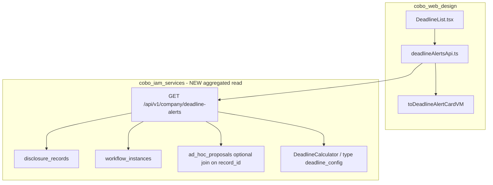

# Implementation Plan — Dữ liệu thật cho tab «Cảnh báo thời hạn» & «Lịch sử CBTT»

**Ngày:** 2026-05-25  
**Mục tiêu:** Thay `mockDeadlines` / `mockDisclosures` bằng API thật, **bám logic đã chốt** trong business contract, ad-hoc audit, deadline-tab plan — **không tự định nghĩa nghiệp vụ mới**.

---

## 1. Nguồn sự thật nghiệp vụ (đã chốt — chỉ trích dẫn)

### 1.1 Ba loại template & cách sinh cảnh báo

Nguồn: `cobo_web_design/docs/ai-cache/skill-outputs/business-contract-adhoc-alert-create.md` §2.1–2.2

| Loại | `templateCategory` | Cách sinh cảnh báo (đã chốt) |
|------|------------------|------------------------------|
| Định kỳ | `periodic` | Hệ thống **tự động push** theo chu kỳ template |
| Bất thường | `irregular` | Doanh nghiệp **tự tạo thủ công** → flow đề xuất ad-hoc |
| Tần suất | `custom` | Hệ thống push theo **tần suất đã cấu hình** |

**Không** dùng `group.id` làm rule tạo cảnh báo (gap đã ghi trong contract).

### 1.2 Tab «Cảnh báo thời hạn» (portal)

Nguồn: `cobo_web_design/docs/business-contract-summary.md` §3.6

- Danh sách deadline, trạng thái: `Upcoming` / `Due Soon` / `Overdue` / `Done`
- Lọc trạng thái, tìm kiếm, khoảng ngày
- Chi tiết deadline; đánh dấu hoàn thành
- **Deadline tự sinh từ loại CBTT định kỳ** (`templateCategory = Định kỳ`)

### 1.3 Ad-hoc proposal (tách phạm vi)

Nguồn: `adhoc-alert-business-one-pager.md`, `adhoc-alert-crud-current-state-business-audit-summary.md`

- Luồng: tạo đề xuất → focal → **người kiểm soát quy trình** (identity, không phải “admin bất kỳ”) → approve cuối
- Khi **approved**: hệ thống **tự động** tạo `disclosure record` + `workflow instance` (`AdminApprove` → `record_id`, `workflow_instance_id`)
- Audit doc **ghi rõ**: phạm vi ad-hoc **không** gồm tab `Cảnh báo thời hạn` — nhưng **lifecycle** §5 kỳ vọng `/app/deadlines` expose trạng thái record/reminder

**Kết luận kỹ thuật (không suy đoán product):** Tab deadlines **không** list `ad_hoc_proposals` đang pending. Item sau approve phải xuất hiện qua **disclosure record + workflow** (cùng nguồn với hồ sơ CBTT đang chạy), không qua API proposal list.

### 1.4 UI card «Cảnh báo thời hạn» (đã review)

Nguồn: `deadline-alerts-tab-plan-review-summary.md`

- Card hiển thị: **Tiêu đề cảnh báo**, **Thời hạn cảnh báo**, **Phòng đang thực hiện**
- **Không** dùng `owner` làm SoT cho phòng đang thực hiện
- **Khuyến nghị kiến trúc đã chốt trong plan:** SoT = backend workflow (`current_step_code` + `snapshot`), FE chỉ map — **không** tự tính timeline T0 độc lập (H3)
- Multi-phòng: H2 chưa chốt đa bước active; **khuyến nghị Phase 2 = Option C** (một `current_step_code` → một department từ snapshot)
- CTA: **giữ** header «Tạo cảnh báo mới»; **bỏ** CTA per-item (H4 đã quyết trong `tasks/todo.md`)

### 1.5 Tab «Lịch sử CBTT»

Nguồn: `business-contract-summary.md` §3.8 + `lifecycle-flow-inventory.md` §3–5

- Hồ sơ CBTT: vòng đời `draft → submitted → confirmed → published → completed`
- Tab History trên cùng màn `/app/deadlines` = **lịch sử hồ sơ**, không phải proposal ad-hoc

### 1.6 Trạng thái due trên BE (map sang FE)

Nguồn: `internal/disclosure/app/deadline_calculator.go` → `deriveSummaryStatus`

| BE `DeadlineSummaryDTO.status` | FE `DeadlineStatus` (§3.6) |
|-------------------------------|----------------------------|
| `OVERDUE` | `Overdue` |
| `DUE_SOON` | `Due Soon` |
| `UPCOMING` | `Upcoming` |
| Record terminal (`published` / `completed` / …) | `Done` (rule cần map từ `disclosure_records.status`) |

---

## 2. Hiện trạng code (fact)

| Thành phần | Thực tế |
|------------|---------|
| `DeadlineList.tsx` | `mockDeadlines`, `mockDisclosures` — **không API** |
| `DeadlineDetail.tsx` | `mockDeadlines.find` |
| `deadlineAlertViewModels.ts` | `activeDepartments` derive từ **template mock**, không workflow |
| BE list disclosures | `GET /api/v1/disclosures` — **không** trả `workflow_instance_id` trong `List()` |
| BE workflow | `GET /api/v1/workflows/instances/{id}` — có `current_step_code`, `snapshot[]` |
| BE ad-hoc approve | Tạo record + submit + workflow (`record_creator.go`) |
| BE deadline alerts list | **Không có** `GET .../deadline-alerts` (`tasks/plan.md` GAP-2) |
| Periodic auto-push job | **Không thấy** trong code (chỉ reminder worker tick); §3.6 «tự sinh định kỳ» = **gap doc vs runtime** — mục 6 |

---

## 3. Định nghĩa «một dòng cảnh báo thời hạn» (implementation, bám lifecycle)

**Một alert item** = một **disclosure record** thuộc company context, thỏa:

1. Có **thời hạn hiển thị** (`planned_date` và/hoặc deadline tính từ type config / workflow T0 / `ad_hoc_proposals.final_deadline_date` khi `record_id` liên kết — dùng field **đã có trong DB**, không bịa field mới trước khi contract hóa)
2. Có **workflow instance** đang gắn record (post-submit / post ad-hoc approve) **hoặc** record ở trạng thái cần theo dõi deadline theo §3.6
3. **Loại trừ** (đề xuất bám record status thật — cần confirm với BA một lần): `draft` không có workflow → không hiện tab «đang theo dõi hạn» (proposal draft vẫn ở `/app/ad-hoc-proposals`)

**Ad-hoc đã approve:** xuất hiện khi `disclosure_records` + `workflow_instances` tồn tại sau `AdminApprove` — **không** đọc `GET /ad-hoc-proposals?status=approved` cho tab này.

---

## 4. Kiến trúc đích (bám plan đã review)



**Nguyên tắc (từ deadline-alerts-tab-plan):**

- Một endpoint **aggregated** — tránh N+1 (20 alerts × 2 fetch)
- `active_departments[]` **pre-compute** phía BE từ `current_step_code` + `snapshot` (Option C)
- FE **không** suy T0 timeline độc lập (H3)

---

## 5. Contract đề xuất (Phase 2 — cần review trước code)

`GET /api/v1/company/deadline-alerts`

**Auth:** company context + `deadline.view` (đồng bộ `menuPermissionMatrix.deadlines`)

**Query (giữ parity filter FE hiện có):** `status`, `q`, `start_date`, `end_date`, `page`, `page_size`

**Item (additive):**

```json
{
  "alert_id": "<record_id>",
  "record_id": "...",
  "workflow_instance_id": "...",
  "type_id": "...",
  "title": "...",
  "due_date": "YYYY-MM-DD",
  "status": "UPCOMING|DUE_SOON|OVERDUE|DONE",
  "active_departments": ["Phòng A"],
  "source": "disclosure_record",
  "template_category": "periodic|irregular|custom"
}
```

**Quy tắc `active_departments` (Option C — từ plan review):**

- Lấy step trong `snapshot` có `step_code == current_step_code`
- `active_departments = [step.Department]` nếu non-empty, else `[]`
- Không implement multi-step active cho đến khi BA chốt H2 (A/B)

**Quy tắc `due_date` / `status` (ưu tiên field có sẵn):**

1. `disclosure_records.planned_date` nếu có
2. Else `ad_hoc_proposals.final_deadline_date` join `record_id`
3. Else tính `DeadlineCalculator` từ `disclosure_types.deadline_config` + company context (cùng logic `GetTypeDetail` — **đã có**)
4. `status`: map `deriveSummaryStatus(remaining_days)`; nếu record terminal → `DONE`

---

## 6. Quyết định PM/BA (đã chốt — 2026-05-25)

| ID | Quyết định | Áp dụng implementation |
|----|------------|-------------------------|
| **P1** | **Bắt buộc có job tạo record trước** (định kỳ tự sinh) | **Đã có trong code:** worker tick gọi `seedPeriodicCycles` + `MaterializePeriodicDisclosures` (`internal/disclosure/app/periodic.go`, `cmd/worker/main.go`). Phase 4 = **verify worker chạy trên dev/prod** + record materialized xuất hiện trong `GET /company/deadline-alerts` — **không** viết job mới từ đầu trừ khi gap runtime. |
| **P2** | **Record `draft` không** vào tab cảnh báo | SQL/list filter: `status != 'draft'` (và chỉ record đã submit / có workflow theo §3). |
| **P3** | **Option C** — một phòng từ `current_step_code` + `snapshot` | `active_departments` tối đa 1 phần tử; BE pre-compute. |
| **P4** | **Chi tiết cảnh báo** theo **`record_id`** | `alert_id` = `record_id`; route FE `/app/deadlines/:id` với `id` = `record_id`; detail load `GET /api/v1/disclosures/{record_id}`. |

**Lưu ý kỹ thuật P1 (fact, không suy đoán):** Worker hiện materialize periodic qua `PeriodicRecordCreator` với **workflow tắt** trong worker (`cmd/worker/main.go` — `workflow disabled in worker`). Record định kỳ materialized có thể **không có** `workflow_instance_id` → `active_departments` có thể `[]` cho đến khi ticket riêng bật workflow trên worker path (ghi nhận, không block list cơ bản).

---

## 7. Lộ trình triển khai (ticket-ready)

### Phase 0 — Chốt contract

- [x] Trả lời P1–P4 (2026-05-25)
- [ ] Approve JSON contract `GET /company/deadline-alerts`
- [ ] Xác nhận map `Done` ↔ `disclosure_records.status` values thực tế trong DB
- [ ] Review doc + `deadline-alerts-tab-plan-review-summary.md`

### Phase 1 — FE shell (đã có plan, có thể song song)

Theo `deadline-alerts-tab-plan-review-summary.md` tickets 1–3:

- T1: Bỏ per-item CTA; đổi «Chi tiết» → «Chi tiết cảnh báo»
- T2–T3: Card VM (`title`, `dueDate`, `activeDepartments`) — **tạm** mock/template cho đến Phase 2
- **Không** claim Phase 1 ticket 4 «T0-based mock derivation» — `tasks/plan.md` GAP-5: spec không đủ

### Phase 2 — BE aggregated endpoint (blocker cho dữ liệu thật)

**Repo:** `cobo_iam_services`

| Ticket | Việc | AC |
|--------|------|-----|
| BE-DA-01 | Module read `company/deadline-alerts` (handler + service + repo query join `disclosure_records` + `workflow_instances` + optional `ad_hoc_proposals`); **exclude `draft`** (P2) | Integration test: record sau ad-hoc approve có trong list |
| BE-DA-02 | Compute `active_departments` từ `current_step_code` + `snapshot` (Option C) | Unit test snapshot mapping |
| BE-DA-03 | Compute `due_date` + `status` theo thứ tự §5; reuse `DeadlineCalculator` | Test OVERDUE/DUE_SOON/UPCOMING |
| BE-DA-04 | AuthZ `deadline.view`; company scope | 403 khi thiếu quyền |
| BE-DA-05 | Pagination + filter `status`, `q`, date range | Parity với FE filter bar |

**Không làm trong BE-DA:** thay đổi ad-hoc state machine; thay đổi `AdminApprove` semantics.

### Phase 3 — FE wire dữ liệu thật

**Repo:** `cobo_web_design`

| Ticket | Việc | AC |
|--------|------|-----|
| FE-DA-01 | `deadlineAlertsApi.ts` + normalizer | Map BE status → `DeadlineStatus` |
| FE-DA-02 | `DeadlineList.tsx` tab Deadlines: fetch thay `mockDeadlines` | Ad-hoc approved record hiển thị |
| FE-DA-03 | `toDeadlineAlertCardVM` dùng `active_departments` từ API, bỏ template mock derivation | Card đúng 3 field §4.2 plan |
| FE-DA-04 | `DeadlineDetail.tsx`: `useParams().id` = **`record_id`** (P4); `GET /disclosures/{record_id}` + workflow instance nếu có | Bỏ hardcoded phòng (GAP-6) |
| FE-DA-05 | Tab History: `GET /api/v1/disclosures` + map status → `DisclosureStatus` FE | Không dùng `mockDisclosures` |

### Phase 4 — Periodic job (P1 = bắt buộc job — đã có code)

| Ticket | Việc | AC |
|--------|------|-----|
| BE-DA-06 | Xác nhận worker deploy + tick log `periodic disclosures materialized` | Dev/prod có record từ `ListActivePeriodicTypes` |
| BE-DA-07 | (Tùy chọn sau) Bật workflow khi materialize trong worker nếu product cần `active_departments` cho định kỳ | Không bắt buộc release 1 |

**Không** viết job materialize mới nếu `MaterializePeriodicDisclosures` đã chạy đủ.

---

## 8. Kiểm thử E2E (bám flow ad-hoc đã chốt)

1. User có `ad_hoc_alert.propose` + process controller được chỉ định
2. Tạo proposal → submit → focal approve → **process controller** admin-approve
3. Verify DB: `ad_hoc_proposals.status=approved`, `record_id`, `workflow_instance_id` set
4. `GET /api/v1/company/deadline-alerts` → có item `record_id` trùng
5. `/app/deadlines` tab **Cảnh báo thời hạn** → card hiển thị title, due date, phòng từ snapshot
6. `/app/ad-hoc-proposals` vẫn list proposal — **không** thay thế tab deadlines

---

## 9. Out of scope (tránh scope creep)

- CRUD proposal / edit draft (adhoc audit §10)
- Notification từng bước proposal
- Thay đổi rule template category trên FE (`group-001`) — ticket riêng theo business-contract-adhoc-alert-create
- Multi-active-step departments (H2 Option A/B) trước khi BA chốt
- Platform CMS deadline-rules catalog (GAP CMS khác)

---

## 10. Tham chiếu file

| Vai trò | Path |
|---------|------|
| FE list (mock) | `cobo_web_design/src/pages/portal/DeadlineList.tsx` |
| FE VM | `cobo_web_design/src/services/deadlineAlertViewModels.ts` |
| BE ad-hoc approve | `cobo_iam_services/internal/adhoc/app/service.go` |
| BE record+workflow | `cobo_iam_services/internal/adhoc/infra/disclosure/record_creator.go` |
| BE deadline calc | `cobo_iam_services/internal/disclosure/app/deadline_calculator.go` |
| BE workflow instance | `cobo_iam_services/internal/workflow/app/contracts.go` |

---

## 11. Thứ tự ưu tiên (sau khi chốt P1–P4)

1. **Phase 2 BE-DA-01…05** — `GET /company/deadline-alerts` (blocker)  
2. **Phase 3 FE-DA-01…05** — wire list + history + detail `record_id`  
3. **Phase 4 BE-DA-06** — verify worker periodic materialize (P1)  
4. **Phase 1** UI CTA/card (song song)  
5. **Phase 0** còn lại: map `Done` ↔ DB status values  
