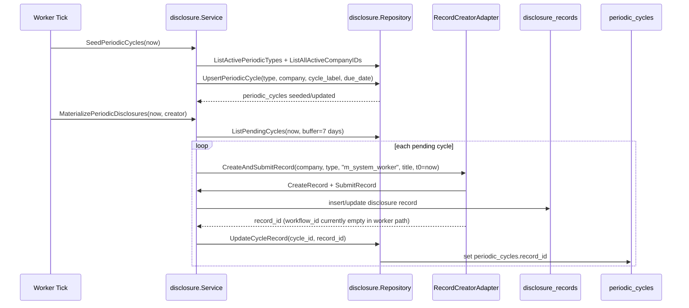
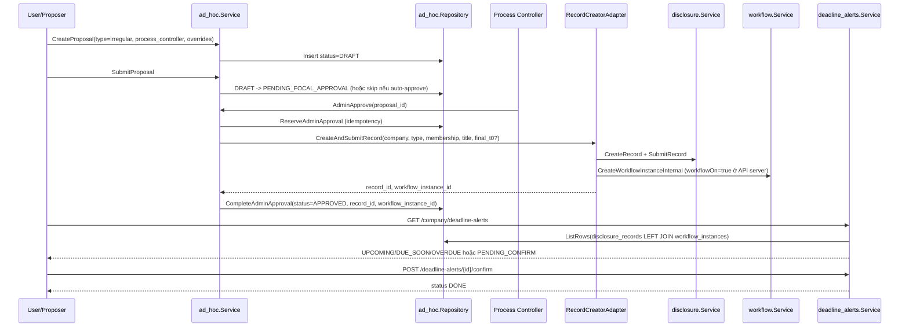

# Quick Review — Sequence Periodic vs Ad-hoc (Current Code)

Ngày cập nhật: 2026-05-27  
Phạm vi: `cobo_iam_services` (runtime flow hiện tại)

## 1) Periodic flow (worker tick)

Ghi chú hiện tại:
- Worker đang wire `RecordCreatorAdapter(disclosureSvc, nil, false)` nên nhánh periodic **chưa bật workflow instance/snapshot** trong worker.
- Cycle lỗi giữ trạng thái pending để retry ở tick sau.

## 2) Ad-hoc irregular flow (proposal -> approval -> alert)

Ghi chú hiện tại:
- Ad-hoc chỉ cho template category `irregular`.
- Duyệt cuối bắt buộc đúng `process_controller_membership_id` đã chỉ định.
- Record terminal nhưng chưa confirm sẽ là `PENDING_CONFIRM`; chỉ thành `DONE` sau API confirm.

