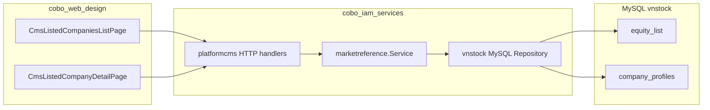

# Implementation plan — CMS: Danh sách công ty niêm yết (vnstock)

> **Ngày tạo:** 2026-05-27  
> **Phase hiện tại:** 1 (MVP tra cứu)  
> **Repos:** `vnstock` (pipeline + MySQL), `cobo_iam_services` (BE API), `cobo_web_design` (CMS FE)  
> **Môi trường dev:** `88.216.208.0` — MySQL container `cobo-iam-mysql`, DB `vnstock`  
> **Trạng thái:** Planned

---

## 1. Mục tiêu & phạm vi

### 1.1 Mục tiêu

Tích hợp dữ liệu công ty niêm yết đã kéo bởi **vnstock pipeline** vào **CMS** (`cobo_web_design`), cho phép:

- Xem **danh sách** toàn bộ mã CK đã đồng bộ.
- **Tìm kiếm** theo **mã chứng khoán** và **tên công ty**.
- Xem **chi tiết hồ sơ cơ bản** theo các nhóm field nghiệp vụ (định danh, thời gian, vốn & CP, nhân sự, pháp lý & liên hệ).

### 1.2 In scope (Phase 1)

| Hạng mục | Chi tiết |
|----------|----------|
| API read-only | List + detail từ MySQL `vnstock` |
| CMS màn hình | List + detail |
| Search | `symbol`, `company_name` |
| Filter | `exchange` (HOSE / HNX / UPCOM), optional `has_profile` |
| Hiển thị MST | Có trên detail (`tax_id` trong JSON) — **không** dùng để search |
| Auth | CMS permission (`platform.cms.view` hoặc permission mới) |

### 1.3 Out of scope (Phase 1)

| Hạng mục | Ghi chú |
|----------|---------|
| Search theo mã số thuế | Phase sau |
| Search theo `business_code` full-text | Phase sau |
| Ghi/sửa dữ liệu vnstock từ CMS | Không |
| Gọi KBS realtime từ CMS | Không — chỉ đọc DB |
| Sync copy sang DB `cobo_iam` | Không — DSN read-only riêng |
| OHLCV, BCTC, events, news trên CMS | Phase sau |
| Trùng route `/cms/admin/companies` | Route mới, tách tenant vs listed |

### 1.4 Phân biệt naming (bắt buộc)

| Khái niệm | Route CMS hiện tại | Route CMS mới |
|----------|-------------------|---------------|
| **Tenant company** (khách hàng COBO) | `/cms/admin/companies` | — |
| **Listed company** (công ty niêm yết VN) | — | `/cms/reference/listed-companies` |

API tenant: `GET /api/v1/platform/cms/admin/companies`  
API listed: `GET /api/v1/platform/cms/market/listed-companies` (đề xuất)

---

## 2. Nguồn dữ liệu & khả năng đáp ứng field

### 2.1 Luồng dữ liệu

```
vnstock pipeline (cron 02:00)
  → Reference().equity.list / company().info / officers / ...
  → MySQL vnstock.equity_list + company_profiles
  → cobo_iam API (read-only)
  → cobo_web_design CMS
```

**Nguồn mặc định:** KBS (`source = kbs`).

### 2.2 Bảng MySQL

| Bảng | Vai trò |
|------|---------|
| `equity_list` | `symbol`, `company_name`, `exchange`, `updated_at` |
| `company_profiles` | `info`, `officers`, `shareholders`, … (JSON), `updated_at` |

DDL: `vnstock/pipeline/db/mysql.py`.

### 2.3 Mapping field yêu cầu → JSON `company_profiles.info`

| Nhóm | Field CMS | Key JSON (KBS) | Ghi chú |
|------|-----------|----------------|---------|
| Định danh | Mã CK | `symbol` | Cột `equity_list` |
| | Tên công ty | — | `equity_list.company_name` |
| | Loại hình công ty | `company_type` | |
| | Sàn niêm yết | `exchange` | HOSE / HNX / UPCOM |
| | Mô hình kinh doanh | `business_model` | |
| | Mã ngành kinh doanh | `business_code` | |
| Thời gian | Ngày thành lập | `founded_date` | |
| | Ngày niêm yết | `listing_date` | |
| | Ngày cập nhật dữ liệu | `as_of_date` | + `company_profiles.updated_at` |
| Vốn & CP | Vốn điều lệ | `charter_capital` | |
| | Mệnh giá | `par_value` | |
| | Giá niêm yết | `listing_price` | |
| | KL CP niêm yết | `listed_volume` | |
| | Số CP lưu hành | `outstanding_shares` | |
| | KL CP tự do LH | `free_float` | |
| | Tỷ lệ CP tự do (%) | `free_float_percentage` | |
| Nhân sự | CEO / TGĐ | `ceo_name`, `ceo_position` | |
| | Trưởng BKS | `inspector_name`, `inspector_position` | |
| | Số lượng NV | `number_of_employees` | Tổng từ LaborStructure (KBS explorer) |
| Pháp lý & LH | Giấy phép thành lập | `establishment_license` | |
| | Mã số thuế | `tax_id` | **Hiển thị only** phase 1 |
| | Công ty kiểm toán | `auditor` | |
| | Địa chỉ, phone, fax, email, website | `address`, `phone`, `fax`, `email`, `website` | |

Map KBS: `vnstock/vnstock/explorer/kbs/const.py` → `_COMPANY_PROFILE_MAP`.

**Rủi ro chất lượng:** Một số mã có thể thiếu field (null) — FE hiển thị `—`.

---

## 3. Kiến trúc kỹ thuật



### 3.1 Nguyên tắc

1. **Read-only** — không mutation trên DB `vnstock`.
2. **DSN tách** — `VNSTOCK_MYSQL_DSN` (user read-only), tách `MYSQL_DSN` của `cobo_iam`.
3. **Không gọi Python vnstock** từ Go runtime CMS request.
4. **Envelope chuẩn CMS** — `writeEnvelope` + `meta` pagination giống `listCMSCompanies`.

### 3.2 Cấu hình môi trường

| Biến | Ví dụ | Mô tả |
|------|-------|-------|
| `VNSTOCK_MYSQL_DSN` | `vnstock:***@tcp(127.0.0.1:3306)/vnstock?parseTime=true&loc=UTC` | Kết nối từ container API tới MySQL host |
| `VNSTOCK_MARKET_ENABLED` | `true` | Feature flag tắt API nếu chưa có DSN |

**Dev:** Pipeline path `/root/cron_company_vnstock`, MySQL trong `cobo-iam-mysql` (xem `vnstock/pipeline/README.md`).

---

## 4. API contract (Phase 1)

### 4.1 List listed companies

```
GET /api/v1/platform/cms/market/listed-companies
```

**Query parameters**

| Param | Type | Required | Mô tả |
|-------|------|----------|-------|
| `q` | string | No | Search: symbol prefix hoặc `company_name` LIKE |
| `exchange` | string | No | `HOSE` \| `HNX` \| `UPCOM` |
| `has_profile` | bool | No | `true` = chỉ mã đã có row `company_profiles` |
| `page` | int | No | Default `1` |
| `limit` | int | No | Default `20`, max `100` |
| `sort_by` | string | No | `symbol` \| `company_name` \| `profile_updated_at` |
| `sort_order` | string | No | `asc` \| `desc` |

**Search behavior (`q`) — Phase 1**

- Trim whitespace; bỏ qua nếu rỗng.
- Nếu `q` khớp `^[A-Za-z0-9]{1,10}$` (sau upper): ưu tiên `symbol LIKE 'Q%'` (case-insensitive).
- Ngược lại: `company_name LIKE '%q%'`.
- **Không** search `tax_id`, `business_code`.

**Response 200**

```json
{
  "data": {
    "items": [
      {
        "symbol": "VIC",
        "company_name": "Tập đoàn Vingroup - Công ty Cổ phần",
        "exchange": "HOSE",
        "company_type": "Công ty Cổ phần",
        "business_model": "Bất động sản",
        "listing_date": "2007-11-15T00:00:00Z",
        "has_profile": true,
        "profile_updated_at": "2026-05-27T02:15:00Z",
        "source": "kbs"
      }
    ]
  },
  "meta": {
    "total": 1533,
    "page": 1,
    "limit": 20
  }
}
```

### 4.2 Get listed company detail

```
GET /api/v1/platform/cms/market/listed-companies/{symbol}
```

**Path:** `symbol` uppercase (normalize server-side).

**Response 200 — `data` object**

```json
{
  "symbol": "VIC",
  "company_name": "...",
  "source": "kbs",
  "profile_updated_at": "...",
  "identity": {
    "company_type": "...",
    "exchange": "HOSE",
    "business_model": "...",
    "business_code": "..."
  },
  "timeline": {
    "founded_date": "...",
    "listing_date": "...",
    "as_of_date": "...",
    "profile_updated_at": "..."
  },
  "capital": {
    "charter_capital": null,
    "par_value": null,
    "listing_price": null,
    "listed_volume": null,
    "outstanding_shares": null,
    "free_float": null,
    "free_float_percentage": null
  },
  "leadership": {
    "ceo_name": "...",
    "ceo_position": "...",
    "inspector_name": "...",
    "inspector_position": "...",
    "number_of_employees": 12345
  },
  "legal_contact": {
    "establishment_license": "...",
    "tax_id": "...",
    "auditor": "...",
    "address": "...",
    "phone": "...",
    "fax": "...",
    "email": "...",
    "website": "..."
  }
}
```

**Response 404:** Symbol không có trong `equity_list`.

**Partial profile:** Symbol có trong `equity_list` nhưng chưa có `company_profiles` → `200` với các nhóm JSON null + `has_profile: false` (hoặc `404` tùy product — **đề xuất 200 partial**).

### 4.3 Auth & permission

| Kiểm tra | Pattern tham chiếu |
|----------|-------------------|
| JWT / session | `h.subject(r)` |
| CMS access | `h.requireCMSAccess` |
| Permission | `platform.cms.view` (MVP) hoặc `cms.market.read` (nếu tách quyền) |

File tham chiếu: `cobo_iam_services/internal/platformcms/transport/http/company_cms_handlers.go`.

### 4.4 Lỗi chuẩn

| HTTP | Code | Khi |
|------|------|-----|
| 400 | `INVALID_REQUEST` | `limit` > 100, `sort_by` invalid |
| 403 | `FORBIDDEN` | Không có CMS permission |
| 404 | `NOT_FOUND` | Symbol không tồn tại |
| 503 | `SERVICE_UNAVAILABLE` | `VNSTOCK_MYSQL_DSN` không cấu hình / DB down |

---

## 5. Backend implementation (`cobo_iam_services`)

### 5.1 Cấu trúc module đề xuất

```
internal/marketreference/
  app/
    types.go          # DTO, request/response
    service.go        # List, GetDetail
  infra/mysql/
    repository.go     # SQL queries
    repository_test.go
  transport/http/
    handlers.go       # listListedCompanies, getListedCompany
```

**Wiring:**

- `internal/platformcms/transport/http/handler.go` — register routes.
- `internal/httpserver/server.go` — inject repository khi `VNSTOCK_MYSQL_DSN` set.
- `configs/config.example.env` — document biến mới.

### 5.2 SQL — List (draft)

```sql
SELECT
  e.symbol,
  e.company_name,
  e.exchange,
  e.updated_at AS equity_updated_at,
  p.updated_at AS profile_updated_at,
  JSON_UNQUOTE(JSON_EXTRACT(p.info, '$.company_type')) AS company_type,
  JSON_UNQUOTE(JSON_EXTRACT(p.info, '$.business_model')) AS business_model,
  JSON_UNQUOTE(JSON_EXTRACT(p.info, '$.listing_date')) AS listing_date,
  (p.symbol IS NOT NULL) AS has_profile
FROM equity_list e
LEFT JOIN company_profiles p
  ON p.symbol = e.symbol AND p.source = 'kbs'
WHERE
  (?exchange IS NULL OR e.exchange = ?exchange)
  AND (
    ?q IS NULL
    OR UPPER(e.symbol) LIKE CONCAT(UPPER(?q), '%')
    OR e.company_name LIKE CONCAT('%', ?q, '%')
  )
  AND (?has_profile IS NULL OR (?has_profile = 1 AND p.symbol IS NOT NULL))
ORDER BY /* dynamic sort */
LIMIT ? LIMIT OFFSET ?;
```

**Count query** tương tự (không LIMIT).

### 5.3 SQL — Detail (draft)

```sql
SELECT e.symbol, e.company_name, e.exchange,
       p.info, p.officers, p.updated_at AS profile_updated_at
FROM equity_list e
LEFT JOIN company_profiles p ON p.symbol = e.symbol AND p.source = 'kbs'
WHERE e.symbol = ?;
```

Parse `info` JSON trong Go → map sang DTO nested (`identity`, `timeline`, …).

### 5.4 Index MySQL (Sprint 0)

Chạy thủ công trên DB `vnstock` (không qua migrate `cobo_iam`):

```sql
-- Optional: prefix search symbol đã có PK(symbol)
CREATE INDEX idx_equity_list_exchange ON equity_list (exchange);
CREATE INDEX idx_equity_list_company_name ON equity_list (company_name(120));
CREATE INDEX idx_company_profiles_updated ON company_profiles (updated_at);
```

### 5.5 Tickets BE

| ID | Mô tả | File / AC |
|----|-------|-----------|
| MKT-BE-001 | Config `VNSTOCK_MYSQL_DSN` + pool | `internal/config`, `server.go` |
| MKT-BE-002 | Repository list + count | `infra/mysql/repository.go` |
| MKT-BE-003 | Repository detail + JSON parse | `infra/mysql/repository.go` |
| MKT-BE-004 | HTTP handlers + register routes | `platformcms/transport/http` |
| MKT-BE-005 | Unit tests mapper | `app/service_test.go` |
| MKT-BE-006 | Integration test (tag `vnstock`) | `repository_test.go` |
| MKT-BE-007 | Postman / openapi snippet | `docs/openapi/` hoặc `postman/` |
| MKT-BE-008 | Cập nhật `fe-route-to-be-endpoint-matrix.md` | docs |

**Exit criteria Sprint 1:** Postman chạy OK trên dev; list + detail VIC/ACB.

---

## 6. Frontend implementation (`cobo_web_design`)

### 6.1 Route & navigation

| Route | Component | Permission |
|-------|-----------|------------|
| `/cms/reference/listed-companies` | `CmsListedCompaniesListPage` | `platform.cms.view` |
| `/cms/reference/listed-companies/:symbol` | `CmsListedCompanyDetailPage` | `platform.cms.view` |

**Nav:** Thêm vào `CmsLayout.tsx` — nhóm mới hoặc pin:

```ts
{ to: '/cms/reference/listed-companies', label: 'layout.nav.listedCompanies' }
```

**App.tsx:** `Route` + `RequirePermission` (pattern `CmsAdminCompaniesListPage`).

### 6.2 Files tạo/sửa

| File | Hành động |
|------|-----------|
| `src/features/cms-core/listedCompanies/CmsListedCompaniesPages.tsx` | **Tạo** — list + detail |
| `src/features/cms-core/listedCompanies/types.ts` | **Tạo** — TS types mirror API |
| `src/features/cms-core/services/cmsApi.ts` | **Sửa** — `listListedCompanies`, `getListedCompany` |
| `src/features/cms-core/routeSpecs.ts` | **Sửa** — spec + endpoints |
| `src/features/cms-core/layout/CmsLayout.tsx` | **Sửa** — nav item |
| `src/features/cms-core/language.tsx` | **Sửa** — i18n `listedCompanies.*`, `layout.nav.listedCompanies` |
| `src/features/cms-core/index.ts` | **Sửa** — export pages |
| `src/App.tsx` | **Sửa** — routes |

### 6.3 UI — List page

Tham chiếu UX: `adminCompanies/CmsAdminCompaniesPages.tsx`.

| Thành phần | Hành vi |
|------------|---------|
| Search input | Local state `qInput` |
| Nút Apply / Enter | Commit → `qApplied`, reset `page=1` |
| Filter sàn | `<select>` HOSE / HNX / UPCOM / Tất cả |
| Checkbox | «Chỉ mã đã có hồ sơ» → `has_profile=true` |
| Bảng | symbol, company_name, exchange, company_type, listing_date, profile_updated_at |
| Pagination | Prev/Next, hiển thị `page/totalPages` |
| Link row | → detail `/:symbol` |
| States | loading, empty, error, forbidden (`CmsRouteScreen`) |

`data-testid`: `cms-listed-companies-list`.

### 6.4 UI — Detail page

| Section | Fields |
|---------|--------|
| Header | symbol, company_name, exchange, badge `has_profile` |
| Định danh | company_type, business_model, business_code |
| Thời gian | founded_date, listing_date, as_of_date, profile_updated_at |
| Vốn & cổ phiếu | charter_capital, par_value, listing_price, listed_volume, outstanding_shares, free_float, free_float_percentage |
| Nhân sự | ceo_name, ceo_position, inspector_*, number_of_employees |
| Pháp lý & liên hệ | establishment_license, **tax_id** (read-only label), auditor, address, phone, fax, email, website (link) |

Format số/ngày: `vi-VN`. Null → `—`.

Banner nếu `!has_profile`: «Hồ sơ chưa được đồng bộ. Chạy pipeline company.»

`data-testid`: `cms-listed-company-detail`.

### 6.5 Tickets FE

| ID | Mô tả | AC |
|----|-------|-----|
| MKT-FE-001 | Types + cmsApi methods | [ ] |
| MKT-FE-002 | List page | [ ] Search, filter, pagination |
| MKT-FE-003 | Detail page | [ ] 5 sections, MST hiển thị |
| MKT-FE-004 | Routes + nav + i18n | [ ] |
| MKT-FE-005 | routeSpecs + test id | [ ] |
| MKT-FE-006 | Unit test mapper (optional) | [ ] |

**Exit criteria Sprint 2:** E2E thủ công trên dev CMS.

---

## 7. Vnstock / Data ops (`vnstock`)

### 7.1 Tiên quyết pipeline

| Việc | Lệnh / kiểm tra |
|------|-----------------|
| Deploy code | `bash deploy.sh` từ `vnstock/` |
| Smoke 1 mã | `PYTHONPATH=. python -m pipeline.run --symbols VIC --tasks company` |
| Full market (nền) | `--all-symbols --tasks company` |
| Verify counts | SQL union count 7 bảng (README) |

### 7.2 Cron (đã có)

```
0 2 * * * cd /root/cron_company_vnstock && ... pipeline.run --all-symbols --tasks company
```

Monitor: `tail -f /root/cron_company_vnstock/pipeline.log`.

### 7.3 Tickets data

| ID | Mô tả |
|----|-------|
| MKT-DATA-001 | Verify `equity_list` > 0 rows trên dev |
| MKT-DATA-002 | Verify `company_profiles` coverage (spot check VIC, ACB, FPT) |
| MKT-DATA-003 | Apply index SQL (mục 5.4) |

---

## 8. Kế hoạch sprint & timeline

| Sprint | Thời lượng ước tính | Deliverable |
|--------|---------------------|---------------|
| **S0** Data & infra | 0.5–1 ngày | DSN, index, pipeline verified |
| **S1** Backend API | 2–3 ngày | 2 endpoints + tests + Postman |
| **S2** CMS FE | 2–3 ngày | List + detail + nav |
| **S3** Picker (optional) | 1–2 ngày | `ListedCompanySymbolPicker` cho form khác |
| **S4** Ops & QA | 1 ngày | Runbook, sign-off checklist |

**Tổng MVP (S0–S2):** ~5–7 ngày dev.

### 8.1 Definition of Done (Phase 1)

- [ ] API list/detail deploy dev, auth đúng permission.
- [ ] CMS list search symbol + tên; filter sàn.
- [ ] CMS detail hiển thị đủ 5 nhóm field; MST hiển thị, không search MST.
- [ ] Không regression `/cms/admin/companies` (tenant).
- [ ] `fe-route-to-be-endpoint-matrix.md` cập nhật.
- [ ] QA checklist (mục 9) pass trên dev.

---

## 9. QA checklist (dev)

| # | Case | Expected |
|---|------|----------|
| 1 | `GET listed-companies` không filter | `200`, `items.length` > 0, `meta.total` khớp |
| 2 | `q=VIC` | Trả về VIC (đầu danh sách hoặc match) |
| 3 | `q=Vingroup` | Match `company_name` |
| 4 | `q=0300588569` (MST) | **Không** match theo MST (phase 1) |
| 5 | `exchange=HOSE` | Chỉ HOSE |
| 6 | `has_profile=true` | Không có row null profile |
| 7 | `GET .../VIC` | Đủ nested groups; dates parse OK |
| 8 | `GET .../NOTEXIST` | `404` |
| 9 | User không CMS permission | `403` FE forbidden screen |
| 10 | DB vnstock down | `503` hoặc error message rõ |
| 11 | Symbol list có, profile chưa sync | List OK; detail banner partial |

---

## 10. Rủi ro & giảm thiểu

| Rủi ro | Mức | Giảm thiểu |
|--------|-----|-------------|
| Nhầm tenant company vs listed | Cao | Naming route/API; copy i18n rõ «Công ty niêm yết» |
| Search chậm ~1500 rows | Thấp | Index; limit `q`; pagination |
| Field null không đồng đều | Trung bình | FE `—`; không assume required |
| Pipeline fail đêm | Trung bình | `has_profile` filter; ops alert log |
| Hai DB khác schema migrate | Thấp | Không migrate vnstock qua cobo_iam |
| Container API không reach MySQL | Trung bình | `VNSTOCK_MYSQL_DSN` host `127.0.0.1` vs docker network — verify deploy |

---

## 11. Phase 2 (backlog)

- Search `tax_id`, `business_code`.
- Materialized view `company_search` + FULLTEXT.
- Tab `officers` / `shareholders` từ JSON columns.
- Autocomplete picker tái s dụng ở tạo tenant / template disclosure.
- Link portal `CompanyProfile` → API listed detail.
- Metric Prometheus: query latency, rows returned.

---

## 12. Tài liệu liên quan

| Tài liệu | Path |
|----------|------|
| Pipeline ops | `vnstock/pipeline/README.md` |
| MySQL DDL | `vnstock/pipeline/db/mysql.py` |
| KBS field map | `vnstock/vnstock/explorer/kbs/const.py` |
| CMS tenant companies (không sửa) | `cobo_web_design/.../CmsAdminCompaniesPages.tsx` |
| FE↔BE matrix | `cobo_iam_services/docs/fe-route-to-be-endpoint-matrix.md` |
| Deploy dev | `cobo_iam_services/docs/deploy-dev-guide.md` |

---

## 13. Changelog

| Ngày | Thay đổi |
|------|----------|
| 2026-05-27 | Tạo plan Phase 1 — bỏ search MST |
