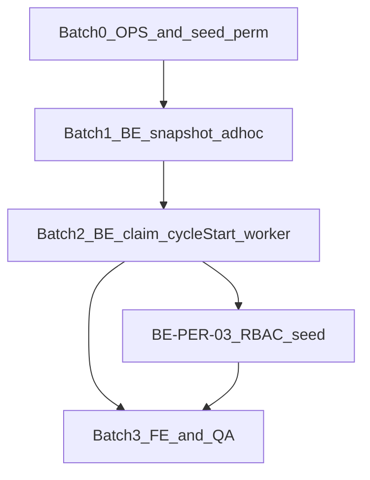

# Implementation Plan E2E — Workflow, Periodic, Ad-hoc & Deadline Alerts

**Phiên bản:** 1.1  
**Ngày:** 2026-05-27  
**PO locked:** 2026-05-27 — mirror [business-contract-workflow-deadline-final.md](./business-contract-workflow-deadline-final.md) §2.1  
**Contract nguồn:** [business-contract-workflow-deadline-final.md](./business-contract-workflow-deadline-final.md) (v1.1-final)  
**Repos:** `cobo_iam_services` (BE), `cobo_web_design` (FE)

---

## 0. Baseline code (đã có / chưa có)

| Hạng mục | Trạng thái code | Ghi chú |
|----------|-----------------|---------|
| Periodic seed + materialize worker | ✅ Có | `periodic.go`, `cmd/worker/main.go` |
| Worker periodic **workflow** | ❌ Tắt | `NewRecordCreatorAdapter(..., nil, false)` |
| Ad-hoc proposal SM + approve | ✅ Có | `adhoc/app/service.go` |
| Ad-hoc approve → workflow instance | ⚠️ Có instance, **không snapshot** | `record_creator.go` không truyền `Snapshot` |
| `FindInstance` đọc `snapshot_json` | ✅ Có | `workflow/infra/mysql/repository.go` |
| `createWorkflowInstance` first step | ❌ Hardcode `"review"` | Chưa WF3-A |
| Snapshot builder (effective + overrides) | ❌ Chưa có module | Cần mới |
| Deadline list + `PENDING_CONFIRM` + confirm API | ✅ Có | `deadlinealerts/*`, migration 0076 |
| FE deadline list confirm | ✅ Có | `deadlineAlertsApi`, `DeadlineList` |
| FE detail degraded / WF2-A / `pending_init` | ❌ Chưa đúng contract | `deadlineAlertDetailViewModels.ts` |
| Periodic preference API | ⚠️ Có endpoint | Chưa `disclosure.auto_create.manage`; FE chưa load GET |
| `cycle_start` column | ❌ Chưa có | Materialize dùng `t0 := now` |
| Optimistic claim materialize | ❌ Chưa có | AC-7 gap |
| Reminder milestone bridge | ✅ Có (flag) | Ngoài P0 contract |

### 0.1 PO decisions P0 (locked — không đổi khi code)

| Chủ đề | Quyết định |
|--------|------------|
| Preference RBAC | PATCH = `disclosure.auto_create.manage`; GET = `disclosure.view` |
| Exactly-once | Optimistic claim trên `periodic_cycles` |
| `cycle_start` | Cột DB, set lúc seed |
| Partial WF fail | Fail materialize; không gắn `record_id` nếu thiếu instance+snapshot |
| Dữ liệu cũ | Không backfill P0 |
| Effective rỗng | 4xx ad-hoc; worker skip + `error_count` |

---

## 1. Mục tiêu release (Definition of Done E2E)

1. Periodic/custom materialize → record + **workflow + snapshot ≥ 1** (WF-A) + claim (AC-7) + T0 = `cycle_start` (AC-9).
2. Ad-hoc approve → snapshot effective + overrides; **4xx** nếu effective rỗng (AC-10).
3. Tab deadline: DC-B (đã có BE/FE list).
4. Chi tiết: WF2-A + OQ-DA-03 HC (`pending_init`).
5. Preferences: RBAC + FE GET theo §6.3 contract.
6. QA matrix §7 pass trên dev (flags bật).

---

## 2. Kiến trúc triển khai (P0 batches)



---

## Batch 0 — OPS + permission seed (0.5 ngày)

### OPS-01 — Flags dev/staging

| Biến | Giá trị |
|------|---------|
| `PERIODIC_SEEDING_ENABLED` | `true` |
| `WORKFLOW_SNAPSHOT_ENABLED` | `true` |
| `WORKFLOW_ADHOC_ENABLED` | `true` |

**Verify:** `/readyz`; worker log seed/materialize.

### OPS-02 — Seed permission (P0)

- Migration/SQL: thêm permission `disclosure.auto_create.manage`
- Gán cho `admin_doanh_nghiep` (dev seed)

**Tests:** không bắt buộc unit; verify sau BE-PER-03.

---

## Batch 1 — BE workflow core (~3 ngày)

**Goal:** Ad-hoc path + snapshot builder; block empty effective (AC-10 ad-hoc).

| ID | Work |
|----|------|
| BE-WF-02 | `internal/workflow/app/snapshot.go` + tests: map, override, `FirstStepCode`, **`ValidateSnapshot`** (empty → error) |
| BE-WF-03 | `CreateRecordOpts`; `record_creator.go` build snapshot → `CreateWorkflowInstanceInternal`; fail trước create nếu snapshot invalid |
| BE-WF-04 | `service.go`: first step từ snapshot, không `"review"` |
| BE-WF-05 | `AdminApprove` truyền `StepOverrides` |

**Không bật worker periodic trong batch này.**

**Files:** [internal/workflow/app/snapshot.go](internal/workflow/app/snapshot.go) (new), [record_creator.go](internal/adhoc/infra/disclosure/record_creator.go), [contracts.go](internal/adhoc/app/contracts.go), [service.go](internal/workflow/app/service.go), [adhoc/app/service.go](internal/adhoc/app/service.go)

**Tests after Batch 1:**

```bash
cd cobo_iam_services
go test ./internal/workflow/app/... ./internal/adhoc/...
go build -o /dev/null ./cmd/api ./cmd/worker
```

---

## Batch 2 — BE periodic P0 (~2 ngày)

**Goal:** WF-A worker + claim + `cycle_start` + preference RBAC.

| ID | Work |
|----|------|
| BE-PER-02 | Migration `cycle_start DATE` trên `periodic_cycles`; seed ghi `cycle_start`; materialize `T0 = cycle.CycleStart` |
| BE-PER-01 | Optimistic claim (`materialize_state` hoặc conditional UPDATE `record_id IS NULL`); chỉ `UpdateCycleRecord` khi có `workflow_instance_id` + snapshot OK |
| BE-WF-06 | `cmd/worker/main.go`: `workflowSvc` mirror [server.go](internal/httpserver/server.go); `NewRecordCreatorAdapter(..., workflowSvc, true)` |
| BE-PER-03 | `GetCompanyTypePreference` → `disclosure.view`; `Upsert` → `disclosure.auto_create.manage` |
| BE-PER-02b | **P1:** `error_count`, `last_error`, skip khi `>= 5` |

**Files:** [periodic.go](internal/disclosure/app/periodic.go), [contracts.go](internal/disclosure/app/contracts.go), [disclosure/infra/mysql/repository.go](internal/disclosure/infra/mysql/repository.go), [cmd/worker/main.go](cmd/worker/main.go), [disclosure/app/service.go](internal/disclosure/app/service.go), migrations `00XX_periodic_cycles_cycle_start.up.sql`, `00XX_disclosure_auto_create_permission.up.sql`

**Tests after Batch 2:**

```bash
cd cobo_iam_services
go test ./internal/disclosure/app/... ./internal/workflow/... ./internal/adhoc/...
make be-test
# Manual: worker tick → periodic record + workflow_instance_id + snapshot; t0_date = cycle_start
```

---

## Batch 3 — FE + QA P0 (~2 ngày)

| ID | Work |
|----|------|
| FE-WF-01 | `workflowDegraded = !hasWorkflow`; `pending_init`; `workflowSnapshotError` (WF2-A); fix `deriveAlertStatus`; `DeadlineDetail.tsx` |
| FE-PER-01 | `DisclosureTypePrefsTab`: API types + GET prefs + Bearer; PATCH chỉ khi có quyền |
| QA-01 | Matrix §7 |

**Tests after Batch 3:**

```bash
cd cobo_web_design
npm run lint
npm run test -- src/services/deadlineAlertDetailViewModels.test.ts src/services/deadlineAlertsApi.test.ts
npm run test
cd ../cobo_iam_services && make be-test
```

---

## 7. QA matrix (P0)

| # | Scenario | Expected |
|---|----------|----------|
| Q1 | Ad-hoc approved, snapshot N>0 | N cards; step1 current |
| Q2 | Periodic sau worker tick | `workflow_instance_id` + snapshot; `t0_date` = cycle start |
| Q3 | Instance id có, snapshot `[]` | FE error + retry (WF2-A) |
| Q4 | Record không workflow | Banner + `pending_init` |
| Q5 | Terminal chưa confirm | `Pending Confirm` → confirm → `Done` |
| Q6 | `WORKFLOW_SNAPSHOT_ENABLED=false` | Fail release checklist |
| Q7 | PATCH preference không `disclosure.auto_create.manage` | 403 |
| Q8 | `t0_date` periodic | Đầu tháng/quý/năm (`cycle_start`), không ngày tick |
| Q9 | Type effective workflow rỗng | Worker không materialize; cycle pending |
| Q10 | Ad-hoc approve type rỗng workflow | 4xx, không record |

---

## 8. Ticket board (Jira-ready)

| ID | Title | Batch | Est |
|----|-------|-------|-----|
| OPS-01 | Enable flags dev | 0 | 0.25d |
| OPS-02 | Seed `disclosure.auto_create.manage` | 0 | 0.25d |
| BE-WF-02 | Snapshot builder + ValidateSnapshot | 1 | 1d |
| BE-WF-03 | RecordCreator + opts | 1 | 1d |
| BE-WF-04 | First step from snapshot | 1 | 0.5d |
| BE-WF-05 | Ad-hoc overrides | 1 | 0.5d |
| BE-PER-02 | `cycle_start` migration + T0 | 2 | 1d |
| BE-PER-01 | Optimistic claim materialize | 2 | 1d |
| BE-WF-06 | Worker workflowOn | 2 | 0.5d |
| BE-PER-03 | Preference RBAC | 2 | 0.5d |
| BE-PER-02b | error_count cap | **P1** | 0.5d |
| FE-WF-01 | Detail VM + DeadlineDetail | 3 | 1d |
| FE-PER-01 | Preferences GET + auth | 3 | 0.5d |
| BE-INT-01 | Integration tests | 3 | 1d |
| FE-INT-01 | Vitest | 3 | 0.5d |
| QA-01 | Manual matrix | 3 | 1d |

**Ước lượng P0:** ~9–10 dev-days (BE-PER-02b P1).

---

## 9. Rủi ro & mitigation

| Rủi ro | Mitigation |
|--------|------------|
| Record INSERT ok, workflow fail | Cycle không complete; orphan edge OQ-DA-03; P1 metric |
| Duplicate periodic record | BE-PER-01 claim trước create |
| Snapshot flag tắt | OPS checklist; Q6 |
| Legacy records no workflow | Không backfill P0; `pending_init` |
| Misconfigured empty effective | AC-10 block; worker `error_count` P1 |

---

## 10. Out of scope (P0)

- CMS workflow override UI đầy đủ
- `POST /deadline-alerts/complete`
- FE fallback `effective-workflow` khi snapshot lỗi
- Email periodic auto-create
- Batch GET all preferences
- **Backfill workflow** cho record cũ (P1)
- **`error_count` retry cap** (P1 — BE-PER-02b)

---

## 11. Rollback

| Layer | Action |
|-------|--------|
| OPS | `WORKFLOW_SNAPSHOT_ENABLED=false`, `PERIODIC_SEEDING_ENABLED=false` |
| Worker | Revert BE-WF-06 → `nil` workflow adapter |
| BE | Revert snapshot/claim commits independently |
| FE | Revert VM commits |
| DB | Giữ cột `cycle_start` additive; không xóa confirmations |

---

## 12. Handoff — file map

| Nhiệm vụ | File |
|----------|------|
| Snapshot | `internal/workflow/app/snapshot.go` |
| Record + WF | `internal/adhoc/infra/disclosure/record_creator.go` |
| Periodic + claim | `internal/disclosure/app/periodic.go`, `disclosure/infra/mysql/repository.go` |
| Worker | `cmd/worker/main.go` |
| Prefs RBAC | `internal/disclosure/app/service.go`, seed migration |
| FE detail | `deadlineAlertDetailViewModels.ts`, `DeadlineDetail.tsx` |
| FE prefs | `AdminCenter.tsx` (`DisclosureTypePrefsTab`) |

**Chi tiết function-level:** [deadline-alert-workflow-overview-implementation-plan.md](./deadline-alert-workflow-overview-implementation-plan.md) §4–5.

---

## 13. Deprecated assumptions (không dùng)

- Worker `workflowOn: false` là trạng thái chấp nhận được
- `rbac.manage` cho preference PATCH
- `t0 = now` tại materialize
- Record periodic “thành công” không workflow (happy path)
- Backfill workflow P0
- File [business-contract-periodic-auto-creation.md](../../cobo_web_design/docs/ai-cache/skill-outputs/business-contract-periodic-auto-creation.md) cho WF/deadline rules (chỉ tham khảo seed/materialize mechanics)
