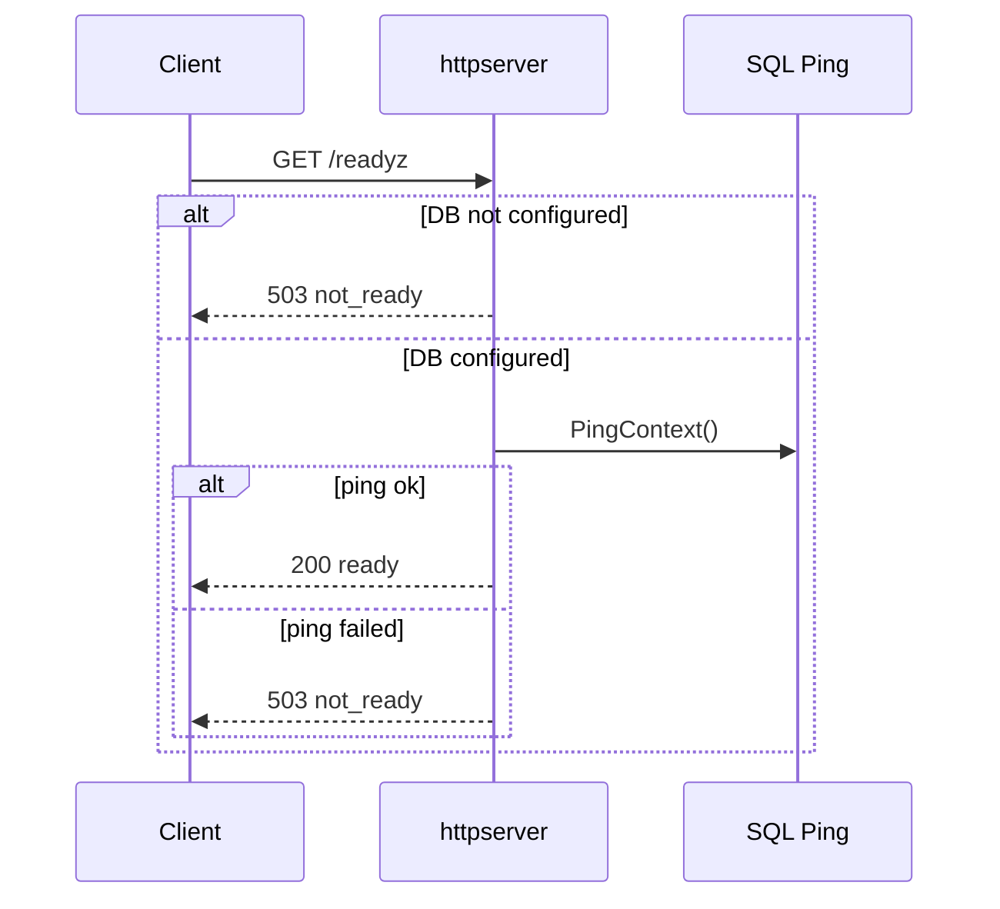
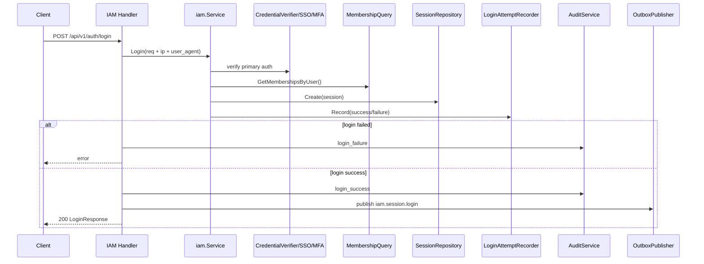
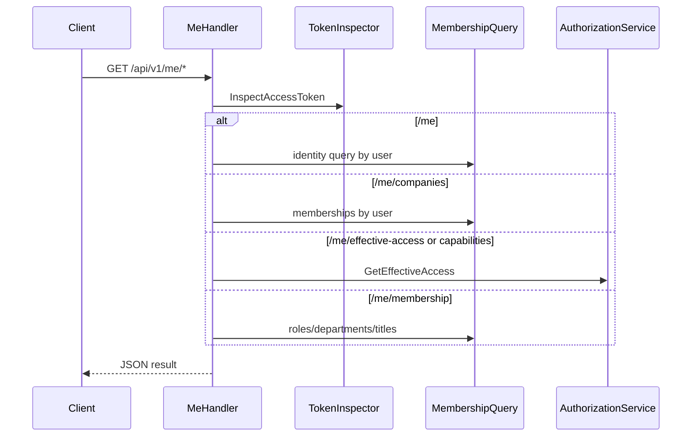
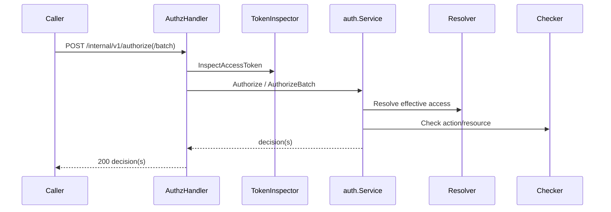
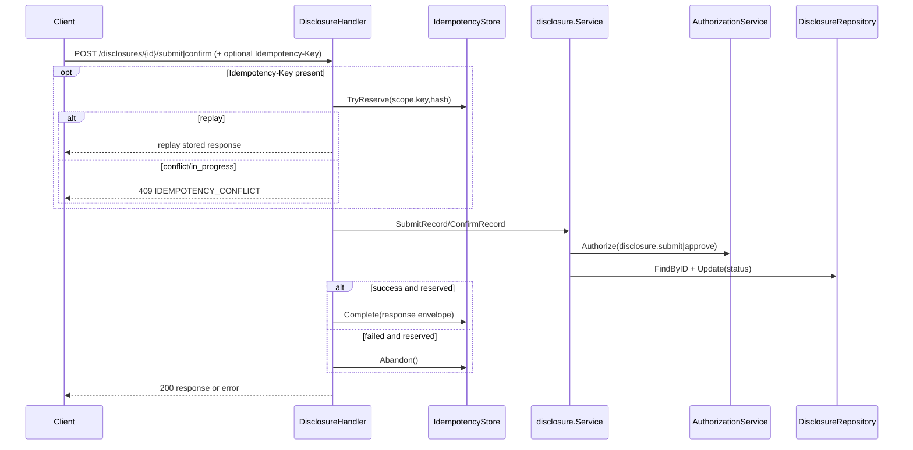
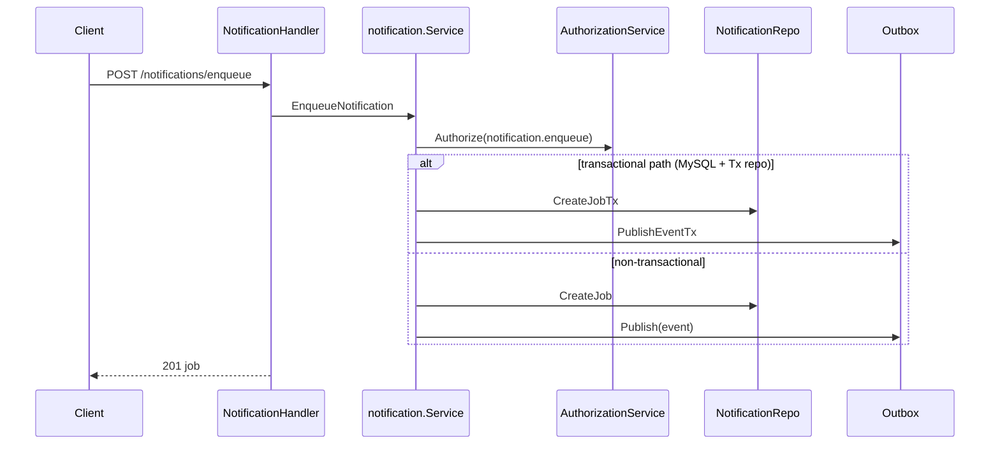
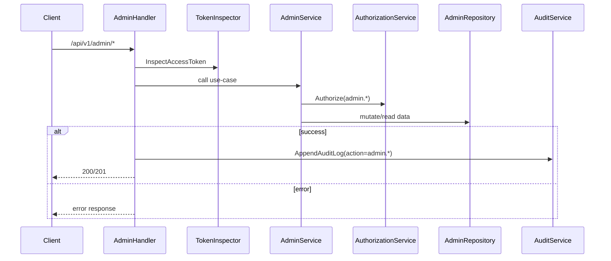

# API Flow va Sequence Flow (runtime hien tai)

Tai lieu nay mo ta **flow runtime thuc te** cua cac API da duoc register trong `internal/httpserver/server.go`.
Muc tieu la de team dev/QA nho nhanh:

- endpoint nao dang mo
- luong xu ly chinh cua tung API
- dependency nao duoc goi (IAM/Authz/Audit/Outbox/MySQL)

> Ghi chu: request/response JSON chi tiet xem `docs/api-contracts-json.md`.

## 1) Tong quan middleware va wiring

- Tat ca request qua `requestIDMiddleware`:
  - doc `X-Request-Id` neu client gui
  - neu thieu thi server tao moi
  - set lai vao response header
- Khi `MYSQL_DSN` duoc set:
  - IAM session/credential/login_attempts dung MySQL
  - Authorization resolver doc MySQL + projection store
  - Audit ghi `audit_logs`
  - Disclosure submit/confirm bat idempotency (`idempotency_keys`)
  - Admin APIs dung MySQL repository
- Khi khong co `MYSQL_DSN`: fallback in-memory cho cac phan tren.

---

## 2) Danh sach API da trien khai

### Health
- `GET /healthz`
- `GET /readyz`

### Auth
- `POST /api/v1/auth/login`
- `POST /api/v1/auth/refresh`
- `POST /api/v1/auth/logout`
- `POST /api/v1/auth/select-company`
- `POST /api/v1/auth/switch-company`

### Me
- `GET /api/v1/me`
- `GET /api/v1/me/companies`
- `GET /api/v1/me/effective-access`
- `GET /api/v1/me/capabilities`
- `GET /api/v1/me/membership`

### Internal Authorization
- `POST /internal/v1/authorize`
- `POST /internal/v1/authorize/batch`

### Disclosure
- `POST /api/v1/disclosures`
- `GET /api/v1/disclosures`
- `GET /api/v1/disclosures/{record_id}`
- `PATCH /api/v1/disclosures/{record_id}`
- `POST /api/v1/disclosures/{record_id}/submit`
- `POST /api/v1/disclosures/{record_id}/confirm`

### Workflow
- `POST /api/v1/workflows/instances`
- `POST /api/v1/workflows/tasks/{task_id}/review`
- `POST /api/v1/workflows/tasks/{task_id}/approve`
- `POST /api/v1/workflows/tasks/{task_id}/confirm`
- `POST /api/v1/workflows/resolve-assignees`

### Notification
- `POST /api/v1/notifications/resolve-recipients`
- `POST /api/v1/notifications/enqueue`
- `POST /api/v1/notifications/dispatch`

### Admin Access
- `POST /api/v1/admin/memberships`
- `PATCH /api/v1/admin/memberships/{membership_id}`
- `DELETE /api/v1/admin/memberships/{membership_id}`
- `GET /api/v1/admin/companies/{company_id}/memberships`
- `POST /api/v1/admin/memberships/{membership_id}/roles`
- `DELETE /api/v1/admin/memberships/{membership_id}/roles/{role_id}`
- `POST /api/v1/admin/memberships/{membership_id}/departments`
- `DELETE /api/v1/admin/memberships/{membership_id}/departments/{department_id}`
- `POST /api/v1/admin/memberships/{membership_id}/titles`
- `DELETE /api/v1/admin/memberships/{membership_id}/titles/{title_id}`
- `GET /api/v1/admin/permissions`
- `GET /api/v1/admin/roles`
- `POST /api/v1/admin/roles/{role_id}/permissions`
- `DELETE /api/v1/admin/roles/{role_id}/permissions/{permission_id}`
- `POST /api/v1/admin/resource-scope-rules`
- `POST /api/v1/admin/workflow-assignee-rules`
- `POST /api/v1/admin/notification-rules`

---

## 3) Sequence flow theo tung API

## 3.1 Health APIs

### `GET /healthz`

- Tra ngay `200 {"status":"ok"}`.

### `GET /readyz`

- Neu khong cau hinh DB -> `503 not_ready`.
- Neu co DB -> `PingContext`; thanh cong `200 ready`, that bai `503 not_ready`.

## 3.2 Auth APIs

### `POST /api/v1/auth/login`

Flow:
- Decode body, gan `IP` + `UserAgent`.
- `iam.Service.Login`:
  - xac thuc primary auth (password hoac SSO hook)
  - check user active
  - MFA hook (neu co)
  - lay memberships active
  - issue access/pre-company token + refresh token
  - tao session
  - ghi `login_attempts` (khi co MySQL recorder)
- Handler:
  - that bai: audit `login_failure`
  - thanh cong: audit `login_success` + publish outbox `iam.session.login`

### `POST /api/v1/auth/refresh`
- Decode body -> `Service.Refresh`.
- Validate refresh token, load session, rotate refresh token, issue access token moi.

### `POST /api/v1/auth/logout`
- Decode body -> `Service.Logout` (revoke refresh/session).
- Audit `logout` + publish `iam.session.logout`.

### `POST /api/v1/auth/select-company`
- Inspect pre-company token.
- Decode `company_id`, bind context vao session (`membership_id + company_id`), issue access token.
- Audit + publish `iam.company.selected`.

### `POST /api/v1/auth/switch-company`
- Inspect access token.
- Decode `company_id`, verify membership active company dich, update context session, issue access token moi.
- Audit + publish `iam.company.switched`.

## 3.3 Me APIs

### `GET /api/v1/me`
- Inspect access token -> `IdentityQueryService.GetByUserID` -> tra user + current context.

### `GET /api/v1/me/companies`
- Inspect access token -> `MembershipQueryService.GetMembershipsByUser`.

### `GET /api/v1/me/effective-access`
- Inspect access token -> `AuthorizationService.GetEffectiveAccess(membership_id, company_id)`.

### `GET /api/v1/me/capabilities`
- Inspect access token -> `GetEffectiveAccess` -> map permissions thanh module flags.

### `GET /api/v1/me/membership`
- Inspect access token -> lay roles/departments/titles cua membership.

## 3.4 Internal Authorization APIs

### `POST /internal/v1/authorize`
- Require access token.
- Merge `subject.user_id` tu token neu request khong gui.
- `AuthorizationService.Authorize`:
  - resolve effective access
  - checker quyet dinh allow/deny

### `POST /internal/v1/authorize/batch`
- Tuong tu endpoint don, nhung loop danh sach checks.

## 3.5 Disclosure APIs

### `POST /api/v1/disclosures`
- Inspect access token -> authorize `disclosure.create` -> insert record (`draft`).

### `GET /api/v1/disclosures`
- Inspect token -> authorize `disclosure.view` -> list theo `company_id`.

### `GET /api/v1/disclosures/{record_id}`
- Inspect token -> authorize `disclosure.view` -> find by id + company.

### `PATCH /api/v1/disclosures/{record_id}`
- Inspect token -> authorize `disclosure.update` -> update title/content/department.

### `POST /api/v1/disclosures/{record_id}/submit`
- Inspect token.
- Neu co `Idempotency-Key` va idempotency store:
  - `TryReserve(scope=disclosure.submit)`
  - replay -> tra response cu
  - conflict/in-progress -> 409
- Goi `SubmitRecord` (authorize + status -> `submitted`).
- Thanh cong `Complete`, that bai `Abandon`.

### `POST /api/v1/disclosures/{record_id}/confirm`
- Tuong tu submit, scope `disclosure.confirm`.
- `ConfirmRecord` enforce state phai la `submitted`, sau do -> `confirmed`.

## 3.6 Workflow APIs

### `POST /api/v1/workflows/instances`
- Inspect token -> authorize `workflow.create`.
- Tao workflow instance (`in_progress`) + tao task dau tien `review` (assignee = membership hien tai).

### `POST /api/v1/workflows/tasks/{task_id}/review`
### `POST /api/v1/workflows/tasks/{task_id}/approve`
### `POST /api/v1/workflows/tasks/{task_id}/confirm`
- Inspect token -> authorize action tuong ung.
- Load task theo company, check assignee trung membership caller, check status `pending`.
- Update status task (`reviewed`/`approved`/`confirmed`).

### `POST /api/v1/workflows/resolve-assignees`
- Inspect token -> authorize `workflow.resolve_assignees`.
- Hien tai skeleton: tra membership hien tai.

## 3.7 Notification APIs

### `POST /api/v1/notifications/resolve-recipients`
- Inspect token -> authorize `notification.resolve_recipients`.
- Skeleton resolver: tra membership hien tai.

### `POST /api/v1/notifications/enqueue`
- Inspect token -> authorize `notification.enqueue`.
- Tao notification job (`pending`).
- Neu du dieu kien MySQL transactional:
  - insert `notification_jobs` + publish outbox event trong cung transaction.
- Neu khong: create job roi publish outbox thuong.

### `POST /api/v1/notifications/dispatch`
- Inspect token -> authorize `notification.dispatch`.
- List pending jobs, resolve recipients, create deliveries, update job status -> `dispatched`.

## 3.8 Admin Access APIs

Tat ca admin APIs chung pattern:
- Inspect access token -> tao `AdminSubject`.
- Goi `AdminService` (ben trong authorize voi action `admin.*`).
- Neu thanh cong thi audit action allow.

### Membership APIs
- `POST /admin/memberships`
- `PATCH /admin/memberships/{membership_id}`
- `DELETE /admin/memberships/{membership_id}`
- `GET /admin/companies/{company_id}/memberships`

### Membership binding APIs
- role: `POST/DELETE /admin/memberships/{membership_id}/roles...`
- department: `POST/DELETE /admin/memberships/{membership_id}/departments...`
- title: `POST/DELETE /admin/memberships/{membership_id}/titles...`

### Role/permission APIs
- `GET /admin/permissions`
- `GET /admin/roles`
- `POST/DELETE /admin/roles/{role_id}/permissions...`

### Rule APIs
- `POST /admin/resource-scope-rules`
- `POST /admin/workflow-assignee-rules`
- `POST /admin/notification-rules`

---

## 4) Bang mapping nhanh API -> flow pattern

- Health: static check + DB ping
- Auth login: IAM + membership + session + audit + outbox (+ login_attempts)
- Auth refresh/logout/select/switch: IAM session/context + audit/outbox (mot so action)
- Me: identity/membership/effective-access query
- Internal authorize: resolver + checker
- Disclosure submit/confirm: authorization + idempotency reserve/replay/conflict
- Workflow: authorization + workflow repo transition
- Notification enqueue: authorization + job + outbox (uu tien transactional)
- Admin: authorization `admin.*` + admin repo + audit

## 5) Ghi chu van hanh

- Header `X-Request-Id` duoc pass-through/tao moi cho moi request.
- Header `Idempotency-Key` hien ap dung cho:
  - `POST /api/v1/disclosures/{record_id}/submit`
  - `POST /api/v1/disclosures/{record_id}/confirm`
- Worker xu ly outbox event type `notification.dispatch` theo polling.

