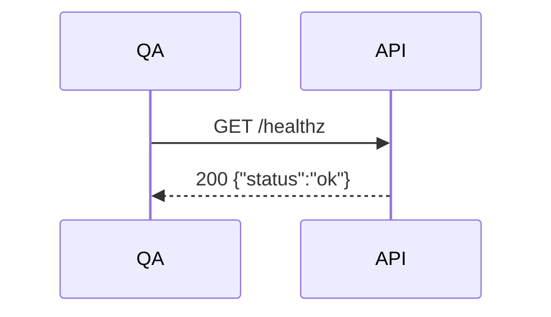
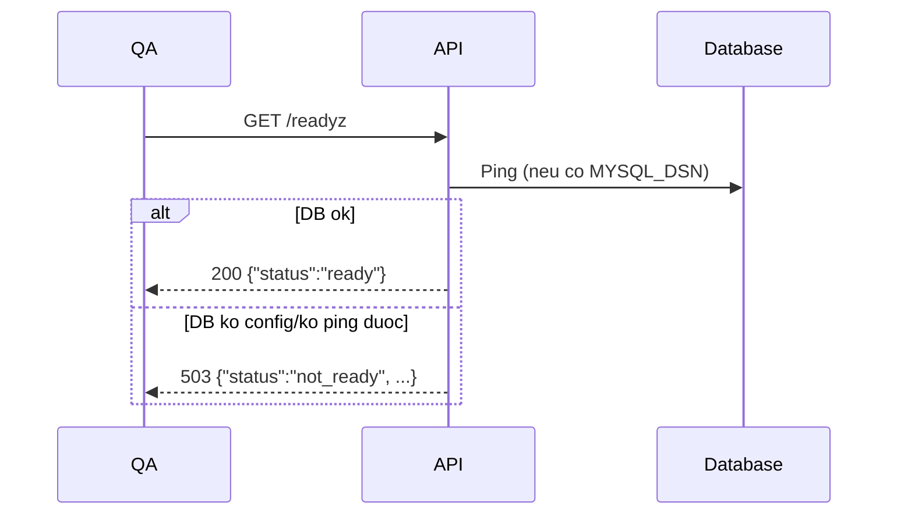
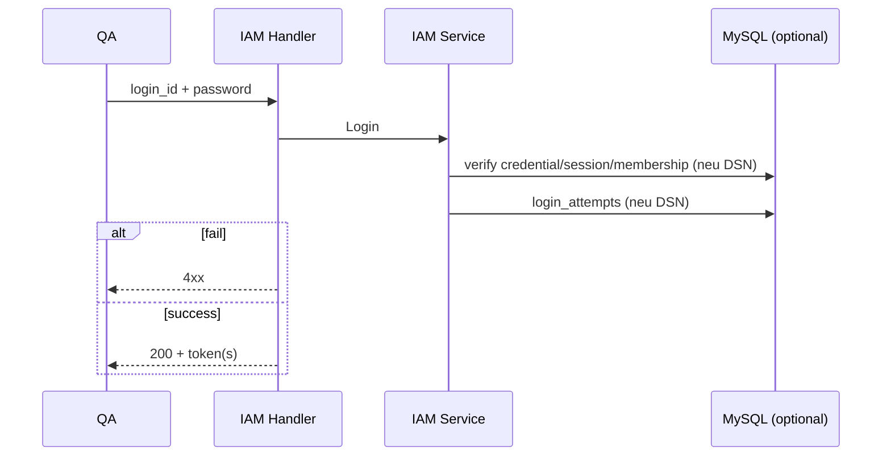
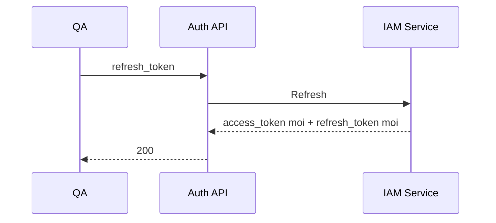
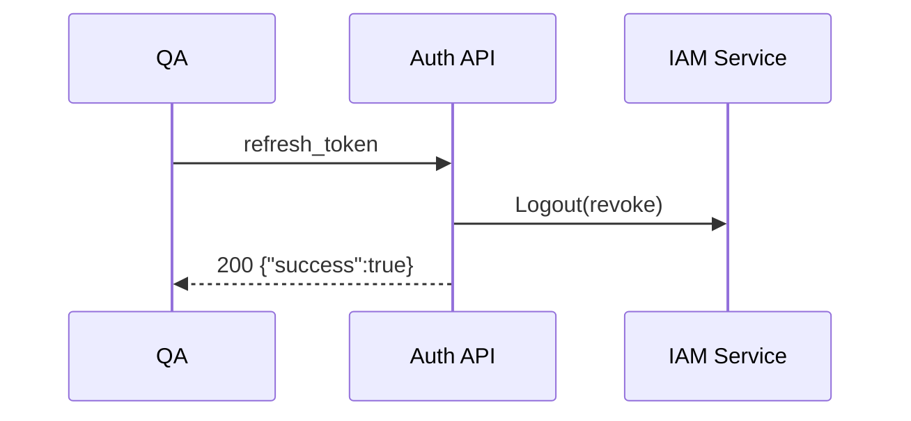
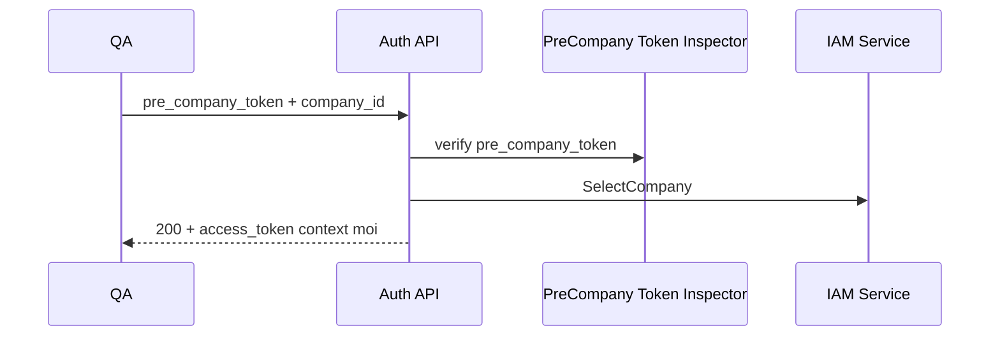
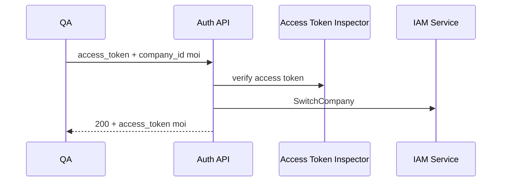
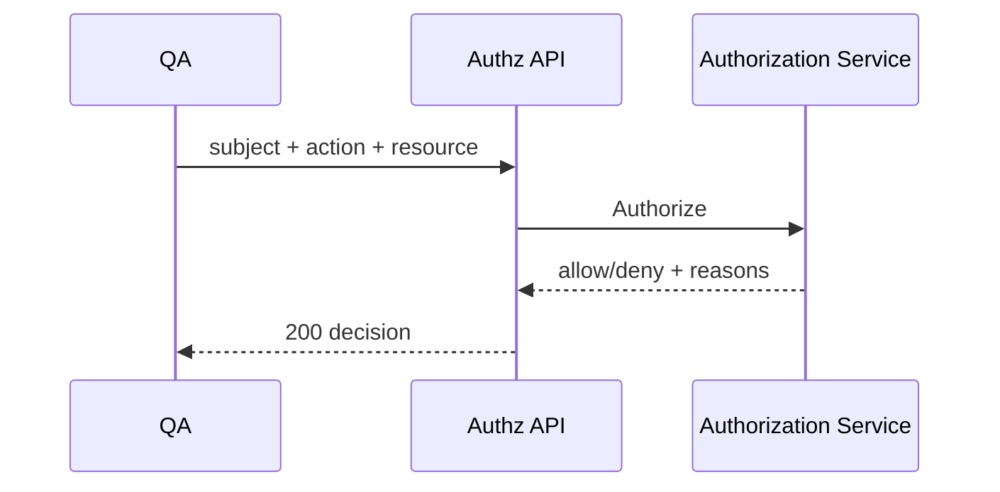
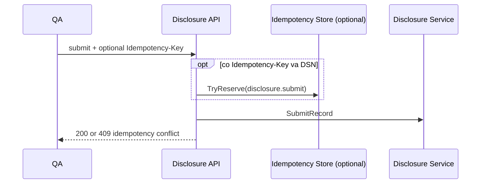
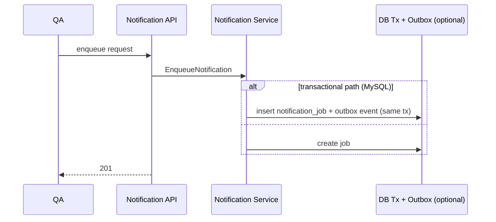

# API Swimlane QA Checklist (1 endpoint = 1 mini-sequence)

Tai lieu nay dung cho QA smoke/regression nhanh theo endpoint.
Moi endpoint co:

- mini-sequence (swimlane ngan gon)
- checklist test truc tiep

Quy uoc:

- Auth header: `Authorization: Bearer <token>`
- Trace header: `X-Request-Id` (optional)
- Idempotency header (neu co): `Idempotency-Key`

---

## 1) Health

### `GET /healthz`

Checklist:
- [ ] Luon tra `200`
- [ ] Body co `status=ok`

### `GET /readyz`

Checklist:
- [ ] Khong `MYSQL_DSN` -> `503`
- [ ] Co `MYSQL_DSN` + DB up -> `200`
- [ ] Co `MYSQL_DSN` + DB down -> `503`

---

## 2) Auth APIs

### `POST /api/v1/auth/login`

Checklist:
- [ ] Sai password -> `INVALID_CREDENTIALS`
- [ ] User 1 company -> co `access_token`, `refresh_token`, `next_action=load_effective_access`
- [ ] User nhieu company -> co `pre_company_token`, `next_action=select_company`
- [ ] Kiem tra `login_attempts` tang dong khi co DSN

### `POST /api/v1/auth/refresh`

Checklist:
- [ ] Refresh token hop le -> `200`
- [ ] Refresh token cu sau rotate -> bi reject
- [ ] Session khong co company context -> `COMPANY_CONTEXT_REQUIRED`

### `POST /api/v1/auth/logout`

Checklist:
- [ ] Logout hop le -> `success=true`
- [ ] Refresh token sau logout khong dung lai duoc

### `POST /api/v1/auth/select-company`

Checklist:
- [ ] Token pre-company hop le + company dung -> `200`
- [ ] Company khong thuoc user -> `MEMBERSHIP_NOT_FOUND`

### `POST /api/v1/auth/switch-company`

Checklist:
- [ ] Company dich hop le -> `200`
- [ ] Company dich khong co membership active -> `MEMBERSHIP_NOT_FOUND`

---

## 3) Me APIs

### `GET /api/v1/me`
Checklist:
- [ ] Token hop le -> tra user + current_context
- [ ] Token loi -> 401/4xx

### `GET /api/v1/me/companies`
Checklist:
- [ ] Tra danh sach memberships theo user token
- [ ] Co du `company_id`, `membership_id`, `membership_status`

### `GET /api/v1/me/effective-access`
Checklist:
- [ ] Tra permissions/data_scope/responsibilities
- [ ] membership/company trong token phai khop context

### `GET /api/v1/me/capabilities`
Checklist:
- [ ] Tra map `modules` boolean
- [ ] User co `view_dashboard` thi `dashboard=true`

### `GET /api/v1/me/membership`
Checklist:
- [ ] Tra `roles`, `departments`, `titles`
- [ ] Department names da sort

---

## 4) Internal Authorization

### `POST /internal/v1/authorize`

Checklist:
- [ ] Action co permission + scope hop le -> `allow`
- [ ] Thieu permission -> `deny` (`PERMISSION_DENIED`)
- [ ] Thieu membership/company -> `COMPANY_CONTEXT_REQUIRED`

### `POST /internal/v1/authorize/batch`
Checklist:
- [ ] So luong `results` = so `checks`
- [ ] Co ca allow va deny theo matrix test

---

## 5) Disclosure APIs

### `POST /api/v1/disclosures`
Checklist:
- [ ] Co quyen `disclosure.create` -> `201`
- [ ] Khong quyen -> `PERMISSION_DENIED`

### `GET /api/v1/disclosures`
Checklist:
- [ ] Chi thay records trong company context

### `GET /api/v1/disclosures/{record_id}`
Checklist:
- [ ] Record dung company -> `200`
- [ ] Record khac company -> deny/not found theo authz

### `PATCH /api/v1/disclosures/{record_id}`
Checklist:
- [ ] Update thanh cong khi co quyen
- [ ] Khong quyen -> deny

### `POST /api/v1/disclosures/{record_id}/submit`

Checklist:
- [ ] Submit lan 1 -> `200`, status record = submitted
- [ ] Replay cung `Idempotency-Key` + cung request -> tra lai response cu
- [ ] Cung key nhung request hash khac -> `409 IDEMPOTENCY_CONFLICT`

### `POST /api/v1/disclosures/{record_id}/confirm`
Checklist:
- [ ] Record dang `submitted` -> `200`, status `confirmed`
- [ ] Record khong o `submitted` -> `STATE_CONFLICT`
- [ ] Idempotency behavior giong endpoint submit

---

## 6) Workflow APIs

### `POST /api/v1/workflows/instances`
Checklist:
- [ ] Tao instance thanh cong -> `201`
- [ ] Tao task dau tien status `pending`

### `POST /api/v1/workflows/tasks/{task_id}/review`
### `POST /api/v1/workflows/tasks/{task_id}/approve`
### `POST /api/v1/workflows/tasks/{task_id}/confirm`
Checklist:
- [ ] Assignee dung membership -> `200`
- [ ] Assignee sai -> `RESPONSIBILITY_REQUIRED`
- [ ] Task khong `pending` -> `STATE_CONFLICT`

### `POST /api/v1/workflows/resolve-assignees`
Checklist:
- [ ] Hien tai tra fallback membership hien tai

---

## 7) Notification APIs

### `POST /api/v1/notifications/resolve-recipients`
Checklist:
- [ ] Hien tai tra fallback membership hien tai

### `POST /api/v1/notifications/enqueue`

Checklist:
- [ ] `event_type` thieu -> `INVALID_REQUEST`
- [ ] Co DSN -> tao job + outbox event
- [ ] Khong quyen -> deny

### `POST /api/v1/notifications/dispatch`
Checklist:
- [ ] Dispatch pending jobs -> `dispatched > 0` (neu co data)
- [ ] Tao deliveries + update job status

---

## 8) Admin APIs

Pattern chung:
- Auth access token
- Authorize `admin.*`
- Mutate/read repo
- Audit log action allow khi thanh cong

Checklist gom nhom:

- Membership CRUD:
  - [ ] create/update/delete/list thanh cong khi co quyen
  - [ ] du lieu persist khi co DSN
- Role/Department/Title assignment:
  - [ ] assign/remove thanh cong
  - [ ] mismatch company -> reject
- Permission/Role APIs:
  - [ ] list permissions/roles tra ve danh sach hop le
  - [ ] assign/remove role_permission dung role_id, permission_id
- Rules APIs:
  - [ ] `resource-scope-rules` can payload required fields
  - [ ] `workflow-assignee-rules`, `notification-rules` can `company_id`
  - [ ] duplicate rule_code trong cung company -> conflict

---

## 9) Quick regression suite de QA chay moi lan release

- [ ] healthz/readyz
- [ ] auth login (success + failure) / refresh rotate / logout
- [ ] me 5 endpoints
- [ ] authorize + authorize/batch
- [ ] disclosure create/update/submit/confirm + idempotency
- [ ] workflow create + task transition + assignee mismatch
- [ ] notification enqueue + dispatch
- [ ] admin: 1 flow membership + 1 flow role_permission + 1 flow rule

